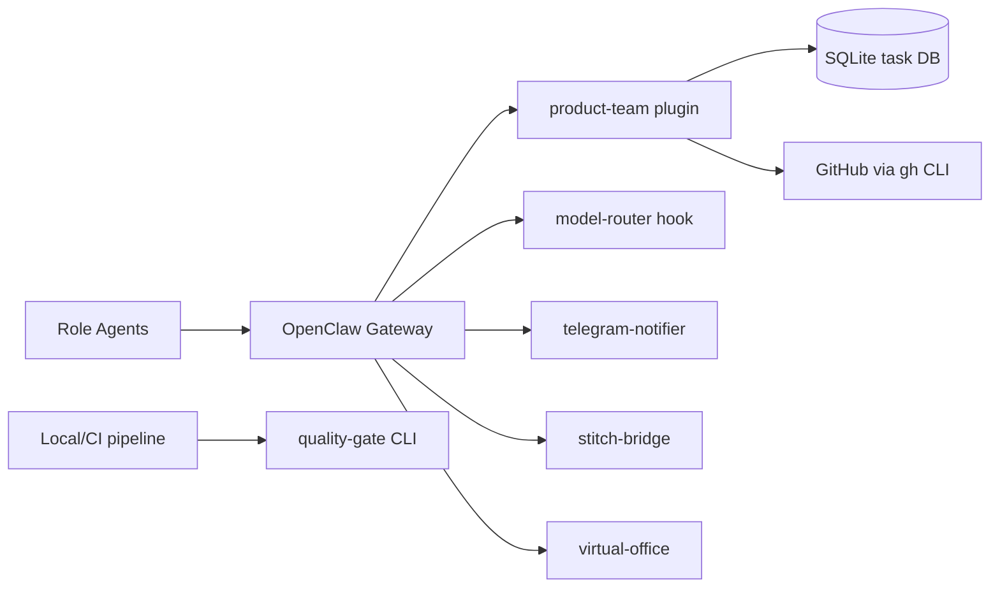

<p align="center">
  
</p>

<h1 align="center">OpenClaw Extensions</h1>

<p align="center">
  An <strong>8-agent autonomous product team</strong> built on <a href="https://openclaw.ai">OpenClaw</a><br/>
  Ships ideas from chat to merged PRs through a 10-stage evidence-gated pipeline.
</p>

<p align="center">
  <a href="https://github.com/Monkey-D-Luisi/vibe-flow/actions/workflows/ci.yml"></a>
  <a href="https://github.com/Monkey-D-Luisi/vibe-flow/actions/workflows/quality-gate.yml"></a>
  <a href="https://github.com/Monkey-D-Luisi/vibe-flow/releases"></a>
  <a href="LICENSE"></a>
</p>

<p align="center">
  
  
  
  
</p>

<p align="center">
  <a href="https://monkey-d-luisi.github.io/vibe-flow/">Website</a> &bull;
  <a href="CONTRIBUTING.md">Contributing</a> &bull;
  <a href="SECURITY.md">Security</a> &bull;
  <a href="docs/api-reference.md">API Reference</a> &bull;
  <a href="CHANGELOG.md">Changelog</a>
</p>

---

## What is this?

An **8-agent autonomous product team** that takes product ideas from concept to
merged pull request through a 10-stage evidence-gated pipeline. Each agent owns
a specific role (PM, PO, Tech Lead, Designer, Backend, Frontend, QA, DevOps)
with dedicated skills, tool policies, and model assignments.

The system runs on [OpenClaw](https://openclaw.ai) in Docker with SQLite
persistence, Telegram for human oversight, and dynamic LLM routing across
multiple providers.

## See It in Action

**Task 0077: The team builds a landing page about itself.**

In March 2026, the 8-agent team completed its first fully autonomous pipeline
run — building a GitHub Pages landing page in **~4 minutes** with zero human
intervention:

- **8 agents** coordinated across all 10 pipeline stages
- **17 files** created (HTML, CSS, JS, SVG, CI workflows)
- **5 auto-resolved decisions** (no human escalation needed)
- **3 operational issues** discovered and subsequently fixed

The PM defined the content strategy, the PO refined user stories, the Tech Lead
decomposed the work, the Designer created a dark-theme visual system, the
Frontend Dev implemented everything, QA validated, the Tech Lead reviewed, and
DevOps created the PR — all autonomously.

Read the full case study: [docs/case-studies/task-0077-autonomous-pipeline.md](docs/case-studies/task-0077-autonomous-pipeline.md)

## Architecture



The product-team extension follows [hexagonal architecture](docs/architecture/hexagonal-layers.md)
with strict inward dependency flow. The [10-stage pipeline](docs/architecture/pipeline-flow.md)
orchestrates work from IDEA to DONE with quality gates at each transition.

**[Full architecture diagrams](docs/architecture/README.md)**

## Prerequisites

| Dependency | Version |
|-----------|---------|
| [OpenClaw](https://openclaw.ai) | latest |
| [Node.js](https://nodejs.org) | 22+ |
| [pnpm](https://pnpm.io) | 10+ |
| [Docker Desktop / Engine](https://www.docker.com/products/docker-desktop/) | latest |
| [GitHub CLI](https://cli.github.com) | latest |

## Quick Start

**Local:**

```bash
git clone https://github.com/Monkey-D-Luisi/vibe-flow.git
cd vibe-flow
pnpm install
pnpm test
```

**Docker:**

```bash
cp .env.docker.example .env.docker
# Edit .env.docker with your credentials
docker compose build && docker compose up -d
docker compose ps
```

See [docs/docker-setup.md](docs/docker-setup.md) for auth credentials, Telegram setup, and troubleshooting.

## Agent Roster

| Agent ID | Role | Primary Model | Skills |
|----------|------|---------------|--------|
| `pm` | Product Manager | openai-codex/gpt-5.2 | requirements-grooming |
| `tech-lead` | Tech Lead | anthropic/claude-opus-4-6 | tech-lead, architecture-design, code-review, adr |
| `po` | Product Owner | github-copilot/gpt-4.1 | product-owner, requirements-grooming |
| `designer` | UI/UX Designer | github-copilot/gpt-4o | ui-designer |
| `back-1` | Backend Developer | anthropic/claude-sonnet-4-6 | backend-dev, tdd-implementation, patterns |
| `front-1` | Frontend Developer | anthropic/claude-sonnet-4-6 | frontend-dev, tdd-implementation |
| `qa` | QA Engineer | anthropic/claude-sonnet-4-6 | qa-testing |
| `devops` | DevOps Engineer | anthropic/claude-sonnet-4-6 | devops, github-automation |

## Extensions

| Extension | Purpose |
|-----------|---------|
| [product-team](extensions/product-team/) | Task engine, workflow orchestration, quality tools, VCS automation, team messaging, decision engine, pipeline, nudge engine |
| [quality-gate](extensions/quality-gate/) | Standalone quality engine + CLI (`pnpm q:gate`, `pnpm q:*`) for local/CI runs |
| [telegram-notifier](extensions/telegram-notifier/) | Telegram notification integration with per-persona bot routing |
| [model-router](extensions/model-router/) | Per-agent model routing hook with fallback chains |
| [stitch-bridge](extensions/stitch-bridge/) | Google Stitch MCP design bridge for the designer agent |
| [virtual-office](extensions/virtual-office/) | Virtual office visualization with agent activity tracking and SSE |

## Tool Surface

38 tools across 10 categories: **task** (5), **workflow** (3), **quality** (5), **vcs** (4), **project** (3), **team** (5), **decision** (4), **pipeline** (7), **metrics** (1), **agent** (1). Plus 7 standalone `qgate_*` tools from the quality-gate extension and 8 `design_*` tools from stitch-bridge.

Full reference: [docs/api-reference.md](docs/api-reference.md)

## Skills

17 role-specific skill libraries providing domain expertise to each agent:

| Skill | Description |
|-------|-------------|
| [adr](skills/adr/) | Architecture Decision Record management |
| [agent-eval](skills/agent-eval/) | Agent evaluation and performance assessment |
| [architecture-design](skills/architecture-design/) | System architecture design workflows |
| [backend-dev](skills/backend-dev/) | Backend development patterns and practices |
| [build-error-resolver](skills/build-error-resolver/) | Automated build error diagnosis and resolution |
| [code-review](skills/code-review/) | Structured code review workflows |
| [devops](skills/devops/) | DevOps, CI/CD, and infrastructure management |
| [frontend-dev](skills/frontend-dev/) | Frontend development patterns and practices |
| [github-automation](skills/github-automation/) | GitHub workflow automation (branches, PRs, labels) |
| [patterns](skills/patterns/) | Software architecture patterns library |
| [product-owner](skills/product-owner/) | Product ownership and backlog management |
| [qa-testing](skills/qa-testing/) | QA testing strategies and test planning |
| [requirements-grooming](skills/requirements-grooming/) | Requirements refinement and user stories |
| [skill-factory](skills/skill-factory/) | Meta-skill for creating new skills |
| [tdd-implementation](skills/tdd-implementation/) | Test-driven development workflows |
| [tech-lead](skills/tech-lead/) | Technical leadership and decision-making |
| [ui-designer](skills/ui-designer/) | UI/UX design workflows and design systems |

## Quality Gates

| Metric | Threshold |
|--------|-----------|
| Line coverage | &ge; 80% (major) / &ge; 70% (minor) |
| Lint errors | 0 |
| TypeScript errors | 0 |
| Avg cyclomatic complexity | &le; 5.0 |

See the [full quality gate evaluation flow](docs/architecture/quality-gates.md).

## Documentation

| Resource | Description |
|----------|-------------|
| [Architecture Diagrams](docs/architecture/README.md) | 8 Mermaid diagrams covering all subsystems |
| [ADRs](docs/adr/) | 16 Architecture Decision Records (ADR-001 through ADR-016) |
| [Case Studies](docs/case-studies/README.md) | Detailed pipeline execution analysis |
| [API Reference](docs/api-reference.md) | Full tool surface documentation |
| [Getting Started](docs/getting-started.md) | Step-by-step setup guide |
| [Roadmap](docs/roadmap.md) | Execution history and upcoming phases |
| [Docker Setup](docs/docker-setup.md) | Container deployment guide |
| [Troubleshooting](docs/troubleshooting.md) | Common issues and solutions |
| [Security](SECURITY.md) | Vulnerability reporting |

## Development

```bash
pnpm test          # Run all tests
pnpm lint          # Lint all packages
pnpm typecheck     # Type-check all packages
pnpm build         # Build all packages
pnpm q:gate        # Run full quality gate
```

## Project Structure

> High-level overview. See [CONTRIBUTING.md](CONTRIBUTING.md) for the full project tree.

```
vibe-flow/
  .agent.md                 # Governance and execution contract
  .agent/rules/             # Workflow rules (next task, review, PR, audits)
  .agent/templates/         # Templates for tasks, walkthroughs, and reviews
  AGENTS.md                 # Generic multi-agent operating instructions
  CLAUDE.md                 # Claude-focused operating instructions
  openclaw.json             # OpenClaw runtime configuration
  extensions/               # OpenClaw plugins and quality CLI package
    product-team/
      src/
        domain/             # Task and workflow domain model
        orchestrator/       # State machine, transitions, guard enforcement
        persistence/        # SQLite repositories and migrations
        quality/            # Runtime quality logic used by product-team tools
        github/             # GitHub integration via gh CLI
        tools/              # Registered OpenClaw tools (task/workflow/quality/vcs)
      test/
    quality-gate/
      src/                  # Standalone quality-gate engine
      cli/                  # q:gate / q:* CLI entrypoints
      test/
    model-router/           # Per-agent model routing hook
    telegram-notifier/      # Telegram notification integration
    stitch-bridge/          # Google Stitch MCP design bridge
    virtual-office/         # Virtual office visualization
  packages/                 # Shared packages
    quality-contracts/      # Shared parsers, gate policy, complexity analysis
  skills/                   # Role skills loaded by OpenClaw (14 roles)
  site/                     # Landing page (GitHub Pages)
  docs/                     # Product, operations, and execution documentation
```

## Build Your Own Extension

vibe-flow is built on OpenClaw's plugin architecture. Each extension follows a
standard pattern with a `register(api)` entry point and an `openclaw.plugin.json`
manifest.

See the [Getting Started Guide](docs/getting-started.md) and
[API Reference](docs/api-reference.md) to build your own extension.

## Landing Page

The `site/` directory contains a static landing page deployed via GitHub Pages —
built entirely by the autonomous agent team ([case study](docs/case-studies/task-0077-autonomous-pipeline.md)).

**Live:** [monkey-d-luisi.github.io/vibe-flow](https://monkey-d-luisi.github.io/vibe-flow/)

## Project Status

**Alpha (v0.2.x)** -- 21 epics across 15 phases completed. The system is
functional with a full autonomous pipeline, dynamic model routing, budget
intelligence, agent learning loop, Telegram command center, and virtual office.

See [docs/roadmap.md](docs/roadmap.md) for execution history and upcoming milestones.

## Star History

<a href="https://star-history.com/#Monkey-D-Luisi/vibe-flow&Date">
  <picture>
    <source media="(prefers-color-scheme: dark)" srcset="https://api.star-history.com/svg?repos=Monkey-D-Luisi/vibe-flow&type=Date&theme=dark" />
    <source media="(prefers-color-scheme: light)" srcset="https://api.star-history.com/svg?repos=Monkey-D-Luisi/vibe-flow&type=Date" />
    
  </picture>
</a>

## Contributing

We welcome contributions! See [CONTRIBUTING.md](CONTRIBUTING.md) for guidelines.

## Security

If you discover a vulnerability, please report it via [GitHub Security Advisories](https://github.com/Monkey-D-Luisi/vibe-flow/security/advisories). See [SECURITY.md](SECURITY.md).

## License

MIT. See [LICENSE](LICENSE).

---

<p align="center">
  Built with <a href="https://openclaw.ai">OpenClaw</a>
</p>
