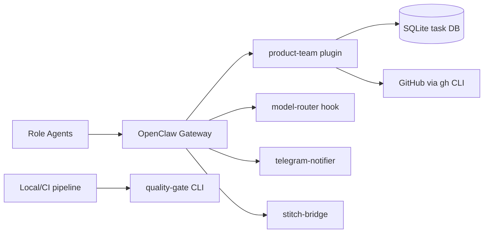

# OpenClaw Extensions

Extensions, skills, and quality tooling for [OpenClaw](https://openclaw.ai).

## Overview

This monorepo contains:

- **`extensions/product-team/`**: primary OpenClaw plugin with task lifecycle, workflow orchestration, quality tooling, and VCS automation.
- **`extensions/quality-gate/`**: standalone quality engine + CLI (`pnpm q:gate`, `pnpm q:*`) used for local/CI quality runs.
- **`extensions/model-router/`**: per-agent model routing hook.
- **`extensions/telegram-notifier/`**: Telegram notification integration.
- **`extensions/stitch-bridge/`**: Google Stitch MCP design bridge.
- **`packages/quality-contracts/`**: shared parsers, gate policy, complexity analysis, and validation contracts.
- **`skills/`**: role-focused skills used by OpenClaw agents.

## Architecture Overview



## Prerequisites

- [OpenClaw](https://openclaw.ai)
- Node.js 22+
- pnpm

## Quick Start

```bash
git clone https://github.com/Monkey-D-Luisi/vibe-flow.git
cd vibe-flow
pnpm install
pnpm test
```

## Development

```bash
pnpm test
pnpm lint
pnpm typecheck
pnpm build
```

## Project Structure

```
vibe-flow/
  .agent.md                 # Governance and execution contract
  .agent/rules/             # Workflow rules (next task, review, PR, audits)
  .agent/templates/         # Templates for tasks, walkthroughs, and reviews
  AGENTS.md                 # Generic multi-agent operating instructions
  CLAUDE.md                 # Claude-focused operating instructions
  openclaw.json             # OpenClaw runtime configuration
  extensions/               # OpenClaw plugins and quality CLI package
    product-team/
      src/
        domain/             # Task and workflow domain model
        orchestrator/       # State machine, transitions, guard enforcement
        persistence/        # SQLite repositories and migrations
        quality/            # Runtime quality logic used by product-team tools
        github/             # GitHub integration via gh CLI
        tools/              # Registered OpenClaw tools (task/workflow/quality/vcs)
      test/
    quality-gate/
      src/                  # Standalone quality-gate engine
      cli/                  # q:gate / q:* CLI entrypoints
      test/
    model-router/           # Per-agent model routing hook
    telegram-notifier/      # Telegram notification integration
    stitch-bridge/          # Google Stitch MCP design bridge
  packages/                 # Shared packages
    quality-contracts/      # Shared parsers, gate policy, complexity analysis, validation contracts
  skills/                   # Role skills loaded by OpenClaw
    adr/
    architecture-design/
    backend-dev/
    code-review/
    devops/
    frontend-dev/
    github-automation/
    patterns/
    product-owner/
    qa-testing/
    requirements-grooming/
    tdd-implementation/
    tech-lead/
    ui-designer/
  docs/                     # Product, operations, and execution documentation
    roadmap.md              # Status and execution queue
    runbook.md              # Operator setup and troubleshooting
    api-reference.md        # Tool-by-tool contract reference
    allowlist-rationale.md  # Agent-tool access justifications
    extension-integration.md
    error-recovery.md
    transition-guard-evidence.md
    adr/
    audits/
    backlog/
    tasks/
    walkthroughs/
```

## Contributing

See [CONTRIBUTING.md](CONTRIBUTING.md).

## License

MIT. See [LICENSE](LICENSE).
