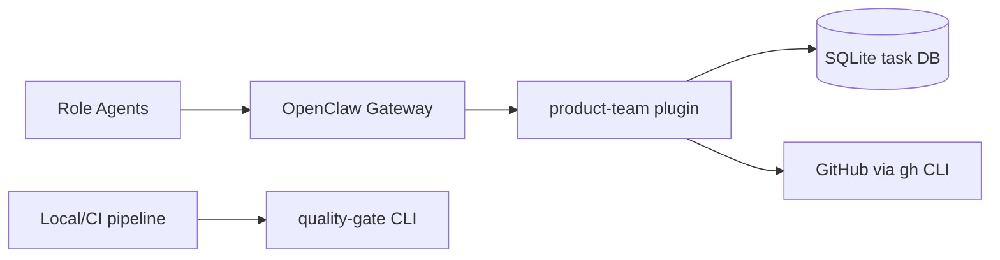

# OpenClaw Extensions

Extensions, skills, and quality tooling for [OpenClaw](https://openclaw.ai).

## Overview

This monorepo contains:

- **`extensions/product-team/`**: primary OpenClaw plugin with task lifecycle, workflow orchestration, quality tooling, and VCS automation.
- **`extensions/quality-gate/`**: standalone quality engine + CLI (`pnpm q:gate`, `pnpm q:*`) used for local/CI quality runs.
- **`packages/schemas/`**: shared JSON Schemas for quality tool input/output.
- **`skills/`**: role-focused skills used by OpenClaw agents.

## Architecture Overview



## Prerequisites

- [OpenClaw](https://openclaw.ai)
- Node.js 22+
- pnpm

## Quick Start

```bash
git clone https://github.com/Monkey-D-Luisi/vibe-flow.git
cd vibe-flow
pnpm install
pnpm test
```

## Development

```bash
pnpm test
pnpm lint
pnpm typecheck
pnpm build
```

## Project Structure

```
vibe-flow/
  .agent.md
  .agent/rules/
  .agent/templates/
  AGENTS.md
  CLAUDE.md
  openclaw.json
  extensions/
    product-team/
      src/
        domain/
        orchestrator/
        persistence/
        quality/
        github/
        tools/
      test/
    quality-gate/
      src/
      cli/
      test/
  packages/
    schemas/
  skills/
    adr/
    architecture-design/
    code-review/
    github-automation/
    patterns/
    qa-testing/
    requirements-grooming/
    tdd-implementation/
  docs/
    roadmap.md
    runbook.md
    api-reference.md
    allowlist-rationale.md
    extension-integration.md
    error-recovery.md
    transition-guard-evidence.md
    adr/
    audits/
    backlog/
    tasks/
    walkthroughs/
```

## Contributing

See [CONTRIBUTING.md](CONTRIBUTING.md).

## License

MIT. See [LICENSE](LICENSE).
