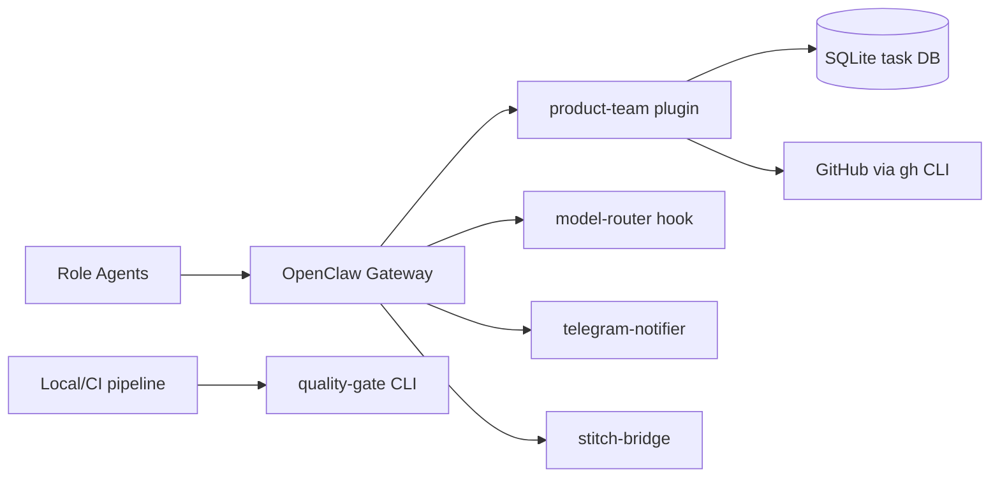

# OpenClaw Extensions


An **8-agent autonomous product team** built on [OpenClaw](https://openclaw.ai) -- ships ideas from chat to merged PRs through a 10-stage evidence-gated pipeline.

## Architecture



## Prerequisites

- [OpenClaw](https://openclaw.ai)
- Node.js 22+
- pnpm 10+
- `gh` CLI (GitHub CLI)

## Quick Start (local)

```bash
git clone https://github.com/Monkey-D-Luisi/vibe-flow.git
cd vibe-flow
pnpm install
pnpm test
```

## Quick Start (Docker)

```bash
cp .env.docker.example .env.docker
# Edit .env.docker with your credentials
docker compose build && docker compose up -d
```

See [docs/docker-setup.md](docs/docker-setup.md) for auth credentials, Telegram setup, and troubleshooting.

## Agent Roster

| Agent ID | Role | Primary Model | Skills |
|----------|------|---------------|--------|
| `pm` | Product Manager | openai-codex/gpt-5.2 | requirements-grooming |
| `tech-lead` | Tech Lead | anthropic/claude-opus-4-6 | tech-lead, architecture-design, code-review, adr |
| `po` | Product Owner | github-copilot/gpt-4.1 | product-owner, requirements-grooming |
| `designer` | UI/UX Designer | github-copilot/gpt-4o | ui-designer |
| `back-1` | Backend Developer | anthropic/claude-sonnet-4-6 | backend-dev, tdd-implementation, patterns |
| `front-1` | Frontend Developer | anthropic/claude-sonnet-4-6 | frontend-dev, tdd-implementation |
| `qa` | QA Engineer | anthropic/claude-sonnet-4-6 | qa-testing |
| `devops` | DevOps Engineer | anthropic/claude-sonnet-4-6 | devops, github-automation |

## Extensions

| Extension | Purpose |
|-----------|---------|
| `product-team` | Task engine, workflow orchestration, quality tools, VCS automation, team messaging, decision engine, pipeline |
| `quality-gate` | Standalone quality engine + CLI (`pnpm q:gate`, `pnpm q:*`) for local/CI runs |
| `telegram-notifier` | Telegram notification integration with per-persona bot routing |
| `model-router` | Per-agent model routing hook with fallback chains |
| `stitch-bridge` | Google Stitch MCP design bridge for the designer agent |

## Tool Surface

35 tools across 7 categories: **task** (5), **workflow** (3), **quality** (5), **vcs** (4), **team** (5), **decision** (3), **pipeline** (7). Plus 8 standalone `qgate_*` tools from the quality-gate extension.

Full reference: [docs/api-reference.md](docs/api-reference.md)

## Security Model

- **Tool allow-lists per agent**: each agent can only call tools explicitly allowed in its policy. CI enforces allow-list correctness ([docs/allowlist-rationale.md](docs/allowlist-rationale.md)).
- **Transition guards**: state machine requires structured evidence in task metadata before advancing (coverage, lint, review results).
- **Decision engine**: auto/escalate/pause/retry policies with circuit breakers and human escalation.
- **CI vulnerability audit**: `pnpm verify:vuln-policy` gates PRs against known vulnerabilities with an exception ledger.

## Cost and Limits

Agents consume LLM provider tokens (Anthropic, OpenAI Codex, GitHub Copilot). Costs depend on provider pricing and task complexity. The plugin tracks token usage and wall-clock time per task via `cost.*` events and supports per-task budget limits with warning alerts.

## Project Status

**Alpha (v0.1.0)** -- the API surface is functional but may change. See [docs/roadmap.md](docs/roadmap.md) for the full execution history and upcoming milestones.

## Development

```bash
pnpm test
pnpm lint
pnpm typecheck
pnpm build
```

## Project Structure

> High-level overview. See [CONTRIBUTING.md](CONTRIBUTING.md) for the full project tree.

```
vibe-flow/
  .agent.md                 # Governance and execution contract
  .agent/rules/             # Workflow rules (next task, review, PR, audits)
  .agent/templates/         # Templates for tasks, walkthroughs, and reviews
  AGENTS.md                 # Generic multi-agent operating instructions
  CLAUDE.md                 # Claude-focused operating instructions
  openclaw.json             # OpenClaw runtime configuration
  extensions/               # OpenClaw plugins and quality CLI package
    product-team/
      src/
        domain/             # Task and workflow domain model
        orchestrator/       # State machine, transitions, guard enforcement
        persistence/        # SQLite repositories and migrations
        quality/            # Runtime quality logic used by product-team tools
        github/             # GitHub integration via gh CLI
        tools/              # Registered OpenClaw tools (task/workflow/quality/vcs)
      test/
    quality-gate/
      src/                  # Standalone quality-gate engine
      cli/                  # q:gate / q:* CLI entrypoints
      test/
    model-router/           # Per-agent model routing hook
    telegram-notifier/      # Telegram notification integration
    stitch-bridge/          # Google Stitch MCP design bridge
  packages/                 # Shared packages
    quality-contracts/      # Shared parsers, gate policy, complexity analysis, validation contracts
  skills/                   # Role skills loaded by OpenClaw
  docs/                     # Product, operations, and execution documentation
    roadmap.md              # Status and execution queue
    runbook.md              # Operator setup and troubleshooting
    api-reference.md        # Tool-by-tool contract reference
    allowlist-rationale.md  # Agent-tool access justifications
  site/                     # Landing page (GitHub Pages)
```

## Landing Page (GitHub Pages)

The `site/` directory contains a static landing page deployed via GitHub Pages.

**Live site:** https://monkey-d-luisi.github.io/vibe-flow/

To use this landing page for your own fork:

1. Fork this repository and push any changes to the `site/` directory.
2. In your fork, go to **Settings → Pages** and set **Source** to GitHub Actions (uses `.github/workflows/deploy-pages.yml`).
3. (Optional) Copy `site/CNAME.example` → `site/CNAME`, set it to your domain, and add a CNAME DNS record pointing to `<your-user>.github.io`.

## Contributing

See [CONTRIBUTING.md](CONTRIBUTING.md).

## Security

See [SECURITY.md](SECURITY.md).

## License

MIT. See [LICENSE](LICENSE).
