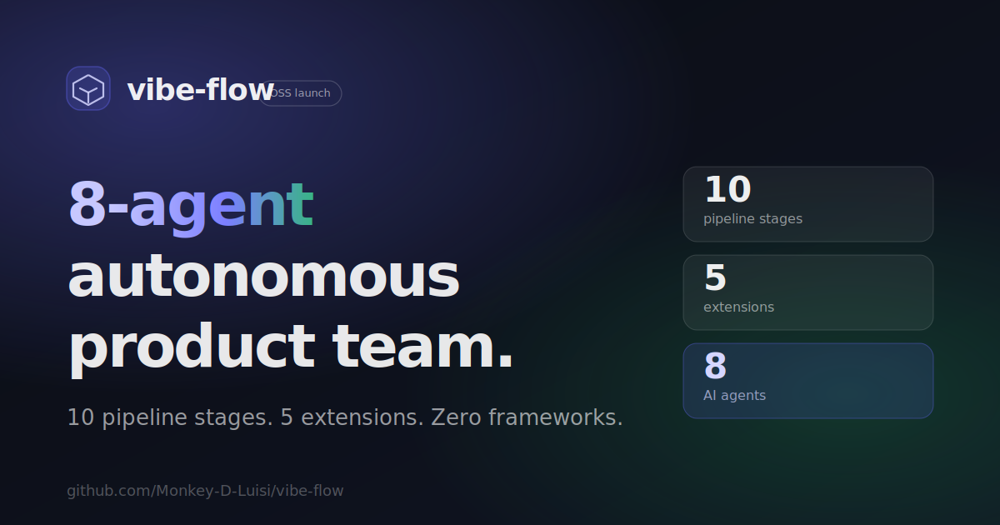
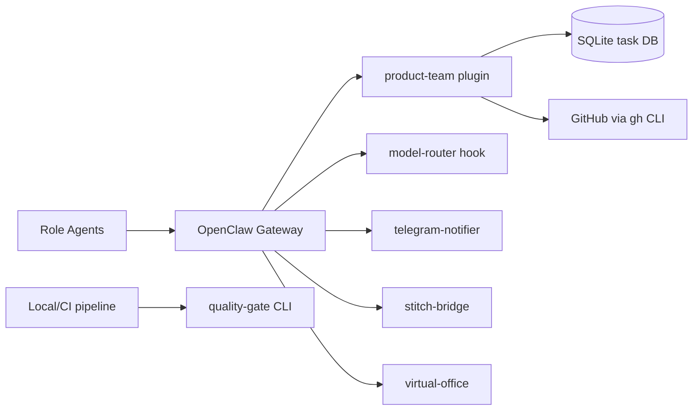

<p align="center">
  
</p>

<h1 align="center">OpenClaw Extensions</h1>

<p align="center">
  An <strong>8-agent autonomous product team</strong> built on <a href="https://openclaw.ai">OpenClaw</a><br/>
  Ships ideas from chat to merged PRs through a 10-stage evidence-gated pipeline.
</p>

<p align="center">
  <a href="https://github.com/Monkey-D-Luisi/vibe-flow/actions/workflows/ci.yml"></a>
  <a href="https://github.com/Monkey-D-Luisi/vibe-flow/actions/workflows/quality-gate.yml"></a>
  <a href="https://github.com/Monkey-D-Luisi/vibe-flow/releases"></a>
  <a href="LICENSE"></a>
</p>

<p align="center">
  
  
  
  
</p>

<p align="center">
  <a href="https://monkey-d-luisi.github.io/vibe-flow/">Website</a> &bull;
  <a href="CONTRIBUTING.md">Contributing</a> &bull;
  <a href="SECURITY.md">Security</a> &bull;
  <a href="docs/api-reference.md">API Reference</a> &bull;
  <a href="CHANGELOG.md">Changelog</a>
</p>

---

## Architecture



## Prerequisites

| Dependency | Version |
|-----------|---------|
| [OpenClaw](https://openclaw.ai) | latest |
| [Node.js](https://nodejs.org) | 22+ |
| [pnpm](https://pnpm.io) | 10+ |
| [Docker Desktop / Engine](https://www.docker.com/products/docker-desktop/) | latest |
| [GitHub CLI](https://cli.github.com) | latest |

## Quick Start

**Local:**

```bash
git clone https://github.com/Monkey-D-Luisi/vibe-flow.git
cd vibe-flow
pnpm install
pnpm test
```

**Docker:**

```bash
cp .env.docker.example .env.docker
# Edit .env.docker with your credentials
docker compose build && docker compose up -d
docker compose ps
```

See [docs/docker-setup.md](docs/docker-setup.md) for auth credentials, Telegram setup, and troubleshooting.

## Current State (March 2026)

- `main` currently includes post-`v0.2.0` work: nudge engine, virtual-office stabilization (pipeline semantics, dashboard readability, responsive sidebar/canvas layout).
- Docker deployment baseline is verified with service `gateway` and container `openclaw-product-team` exposed at `http://localhost:28789`.
- Core monorepo checks (`pnpm -r lint`, `pnpm -r typecheck`, `pnpm -r test`) are green on the latest documentation update push to `main`.

## Agent Roster

| Agent ID | Role | Primary Model | Skills |
|----------|------|---------------|--------|
| `pm` | Product Manager | openai-codex/gpt-5.2 | requirements-grooming |
| `tech-lead` | Tech Lead | anthropic/claude-opus-4-6 | tech-lead, architecture-design, code-review, adr |
| `po` | Product Owner | github-copilot/gpt-4.1 | product-owner, requirements-grooming |
| `designer` | UI/UX Designer | github-copilot/gpt-4o | ui-designer |
| `back-1` | Backend Developer | anthropic/claude-sonnet-4-6 | backend-dev, tdd-implementation, patterns |
| `front-1` | Frontend Developer | anthropic/claude-sonnet-4-6 | frontend-dev, tdd-implementation |
| `qa` | QA Engineer | anthropic/claude-sonnet-4-6 | qa-testing |
| `devops` | DevOps Engineer | anthropic/claude-sonnet-4-6 | devops, github-automation |

## Extensions

| Extension | Purpose |
|-----------|---------|
| [product-team](extensions/product-team/) | Task engine, workflow orchestration, quality tools, VCS automation, team messaging, decision engine, pipeline, nudge engine |
| [quality-gate](extensions/quality-gate/) | Standalone quality engine + CLI (`pnpm q:gate`, `pnpm q:*`) for local/CI runs |
| [telegram-notifier](extensions/telegram-notifier/) | Telegram notification integration with per-persona bot routing |
| [model-router](extensions/model-router/) | Per-agent model routing hook with fallback chains |
| [stitch-bridge](extensions/stitch-bridge/) | Google Stitch MCP design bridge for the designer agent |
| [virtual-office](extensions/virtual-office/) | Virtual office visualization with agent activity tracking and SSE |

## Tool Surface

38 tools across 10 categories: **task** (5), **workflow** (3), **quality** (5), **vcs** (4), **project** (3), **team** (5), **decision** (4), **pipeline** (7), **metrics** (1), **agent** (1). Plus 7 standalone `qgate_*` tools from the quality-gate extension and 8 `design_*` tools from stitch-bridge.

Full reference: [docs/api-reference.md](docs/api-reference.md)

## Quality Gates

| Metric | Threshold |
|--------|-----------|
| Line coverage | &ge; 80% (new) / &ge; 70% (overall) |
| Lint errors | 0 |
| TypeScript errors | 0 |
| Avg cyclomatic complexity | &le; 5.0 |

## Security Model

- **Tool allow-lists per agent**: each agent can only call tools explicitly allowed in its policy. CI enforces allow-list correctness ([docs/allowlist-rationale.md](docs/allowlist-rationale.md)).
- **Transition guards**: state machine requires structured evidence in task metadata before advancing (coverage, lint, review results).
- **Decision engine**: auto/escalate/pause/retry policies with circuit breakers and human escalation.
- **CI vulnerability audit**: `pnpm verify:vuln-policy` gates PRs against known vulnerabilities with an exception ledger.

## Cost and Limits

Agents consume LLM provider tokens (Anthropic, OpenAI Codex, GitHub Copilot). Costs depend on provider pricing and task complexity. The plugin tracks token usage and wall-clock time per task via `cost.*` events and supports per-task budget limits with warning alerts.

## Development

```bash
pnpm test          # Run all tests
pnpm lint          # Lint all packages
pnpm typecheck     # Type-check all packages
pnpm build         # Build all packages
pnpm q:gate        # Run full quality gate
```

## Project Structure

> High-level overview. See [CONTRIBUTING.md](CONTRIBUTING.md) for the full project tree.

```
vibe-flow/
  .agent.md                 # Governance and execution contract
  .agent/rules/             # Workflow rules (next task, review, PR, audits)
  .agent/templates/         # Templates for tasks, walkthroughs, and reviews
  AGENTS.md                 # Generic multi-agent operating instructions
  CLAUDE.md                 # Claude-focused operating instructions
  openclaw.json             # OpenClaw runtime configuration
  extensions/               # OpenClaw plugins and quality CLI package
    product-team/
      src/
        domain/             # Task and workflow domain model
        orchestrator/       # State machine, transitions, guard enforcement
        persistence/        # SQLite repositories and migrations
        quality/            # Runtime quality logic used by product-team tools
        github/             # GitHub integration via gh CLI
        tools/              # Registered OpenClaw tools (task/workflow/quality/vcs)
      test/
    quality-gate/
      src/                  # Standalone quality-gate engine
      cli/                  # q:gate / q:* CLI entrypoints
      test/
    model-router/           # Per-agent model routing hook
    telegram-notifier/      # Telegram notification integration
    stitch-bridge/          # Google Stitch MCP design bridge
    virtual-office/         # Virtual office visualization
  packages/                 # Shared packages
    quality-contracts/      # Shared parsers, gate policy, complexity analysis
  skills/                   # Role skills loaded by OpenClaw (14 roles)
  site/                     # Landing page (GitHub Pages)
  docs/                     # Product, operations, and execution documentation
```

## Landing Page

The `site/` directory contains a static landing page deployed via GitHub Pages.

**Live:** [monkey-d-luisi.github.io/vibe-flow](https://monkey-d-luisi.github.io/vibe-flow/)

## Project Status

**Alpha (v0.2.x)** -- the API surface is functional but may change as EP16+ work lands. See [docs/roadmap.md](docs/roadmap.md) for execution history and upcoming milestones.

## Star History

<a href="https://star-history.com/#Monkey-D-Luisi/vibe-flow&Date">
  <picture>
    <source media="(prefers-color-scheme: dark)" srcset="https://api.star-history.com/svg?repos=Monkey-D-Luisi/vibe-flow&type=Date&theme=dark" />
    <source media="(prefers-color-scheme: light)" srcset="https://api.star-history.com/svg?repos=Monkey-D-Luisi/vibe-flow&type=Date" />
    
  </picture>
</a>

## Contributing

We welcome contributions! See [CONTRIBUTING.md](CONTRIBUTING.md) for guidelines.

## Security

If you discover a vulnerability, please report it via [GitHub Security Advisories](https://github.com/Monkey-D-Luisi/vibe-flow/security/advisories). See [SECURITY.md](SECURITY.md).

## License

MIT. See [LICENSE](LICENSE).

---

<p align="center">
  Built with <a href="https://openclaw.ai">OpenClaw</a>
</p>
