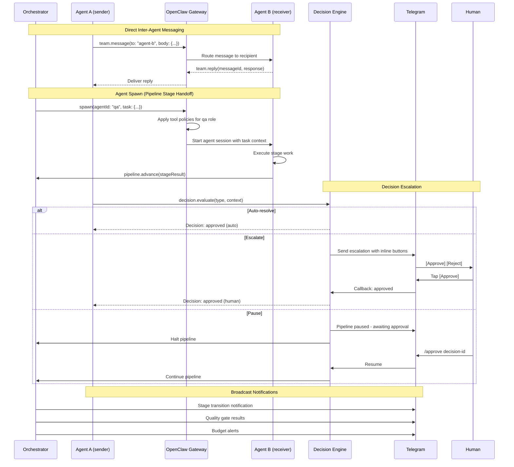

# Agent Communication

Sequence diagram showing inter-agent messaging, spawn mechanism, and decision
escalation patterns.

**What this shows:** Agents communicate through three patterns: (1) direct
messaging via `team.message`/`team.reply` through the gateway, (2) agent
spawn for pipeline stage handoffs where the orchestrator starts a new agent
session, and (3) decision escalation where the decision engine routes
decisions to auto-resolve, escalate via Telegram, or pause the pipeline
for human approval.
