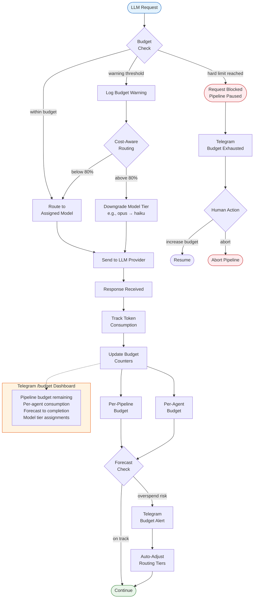

# Budget Flow

Flowchart showing budget enforcement, model tier downgrade, and alerting.

**What this shows:** Every LLM request passes through budget checks. If budget
is within limits, the request routes normally. At the warning threshold (80%),
the cost-aware router automatically downgrades the model tier (e.g., from
claude-3-opus to claude-3-haiku). At the hard limit, the pipeline pauses and
alerts the human operator via Telegram. Token consumption is tracked per-pipeline
and per-agent, with forecasting that triggers proactive alerts when overspend
is likely. The `/budget` Telegram command provides real-time visibility into
all budget metrics.
