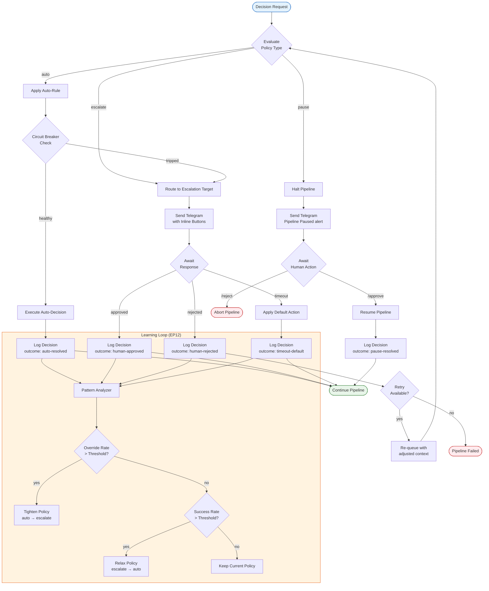

# Decision Engine

Flowchart showing the decision engine's auto/escalate/pause paths with
circuit breaker and timeout handling.

**What this shows:** When a decision is requested, the engine evaluates the
policy type. **Auto** decisions execute immediately (unless the circuit breaker
is tripped, which escalates instead). **Escalate** decisions notify via Telegram
with approve/reject buttons — timeouts apply a default action. **Pause** decisions
halt the pipeline until explicit human approval. All outcomes are logged and fed
to the learning loop (EP12), which adjusts policies based on override and success
rates.
