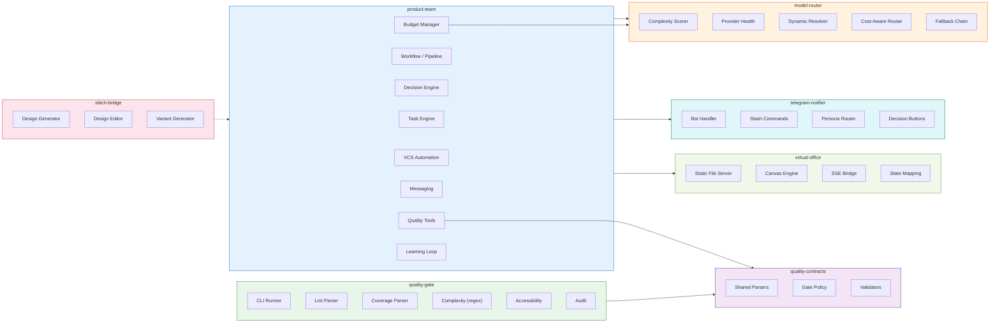

# Extension Architecture

Component diagram showing the 6 extensions and how they interact.

**What this shows:** The product-team extension is the core, containing the task
engine, pipeline, decision engine, quality tools, VCS automation, messaging,
budget management, and learning loop. Both product-team and quality-gate consume
shared parsers from quality-contracts. The model-router provides dynamic LLM
routing. Telegram-notifier and virtual-office provide human interfaces. The
stitch-bridge connects to Google Stitch for design generation.
