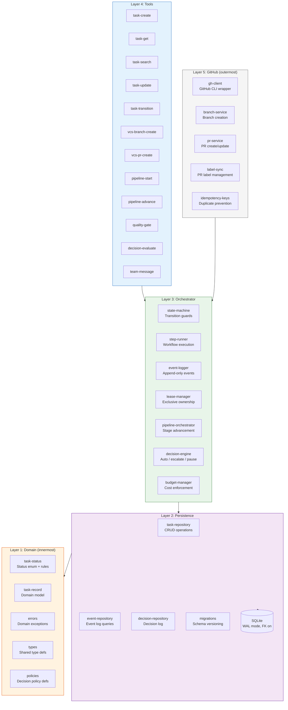

# Hexagonal Layers

Component diagram showing the product-team extension's hexagonal (ports and
adapters) architecture with strict inward dependency flow.

**What this shows:** The product-team extension follows hexagonal architecture
with 5 layers where dependencies flow strictly inward. The Domain layer
(innermost) has zero external dependencies — pure types and business rules.
Persistence wraps SQLite access behind repository interfaces. The Orchestrator
contains the state machine, pipeline logic, and decision engine. Tools are thin
MCP adapters that validate input and delegate to the orchestrator. GitHub
(outermost) is isolated for easy mocking and disabling.
