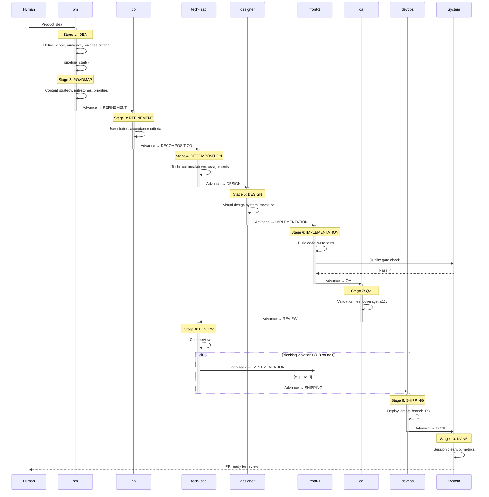

# Pipeline Flow

Sequence diagram showing the 10-stage pipeline with agent handoffs and
quality gates.

**What this shows:** A product idea flows through 10 sequential stages, each
owned by a specific agent. Quality gates are checked between stages. The
REVIEW stage can loop back to IMPLEMENTATION if blocking violations are found
(up to 3 rounds). The pipeline completes when DevOps creates the PR and the
system performs cleanup.
