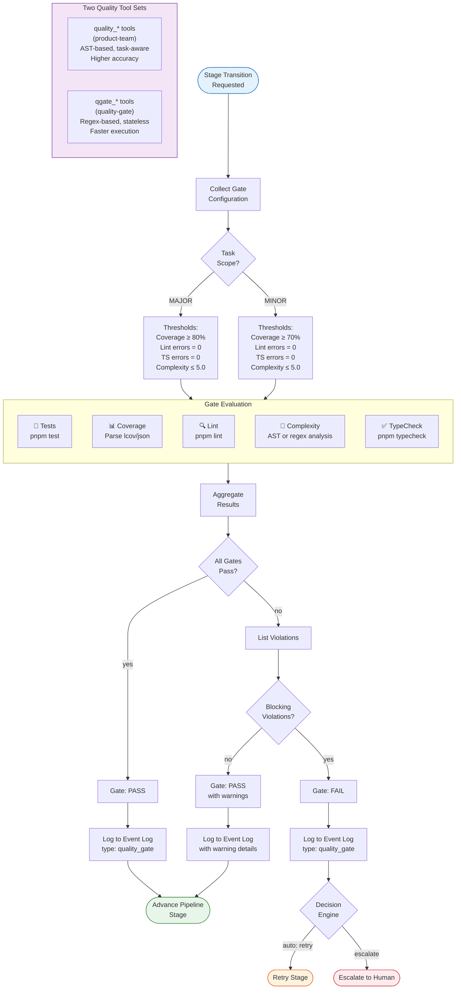

# Quality Gates

Flowchart showing the quality gate evaluation pipeline used at stage
transitions.

**What this shows:** When a pipeline stage transition is requested, the system
evaluates quality gates against scope-dependent thresholds (MAJOR tasks require
80% coverage, MINOR tasks require 70%). Five checks run: tests, coverage, lint,
complexity, and type checking. If all pass, the pipeline advances. Blocking
violations trigger the decision engine (auto-retry or human escalation).
Non-blocking violations generate warnings but allow advancement. Two separate
tool sets exist: `quality_*` (AST-based, task-aware) for pipeline enforcement
and `qgate_*` (regex-based, stateless) for fast CLI scans.
