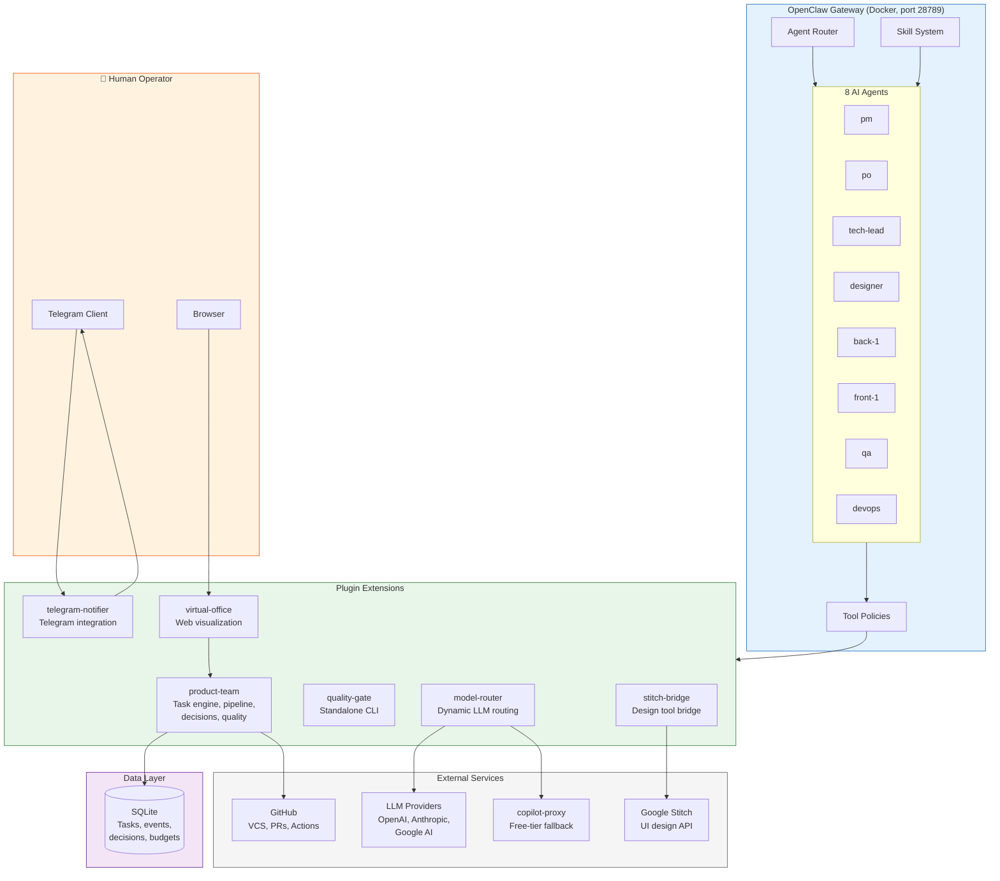

# System Overview

High-level context diagram showing how vibe-flow's components interact with
each other and external systems.

**What this shows:** The OpenClaw gateway runs in Docker and routes requests to
8 AI agents based on role. Agents interact with the system through tool policies
that delegate to 6 plugin extensions. Extensions connect to external services
(GitHub, LLM providers, Telegram, Stitch) and a shared SQLite database.
