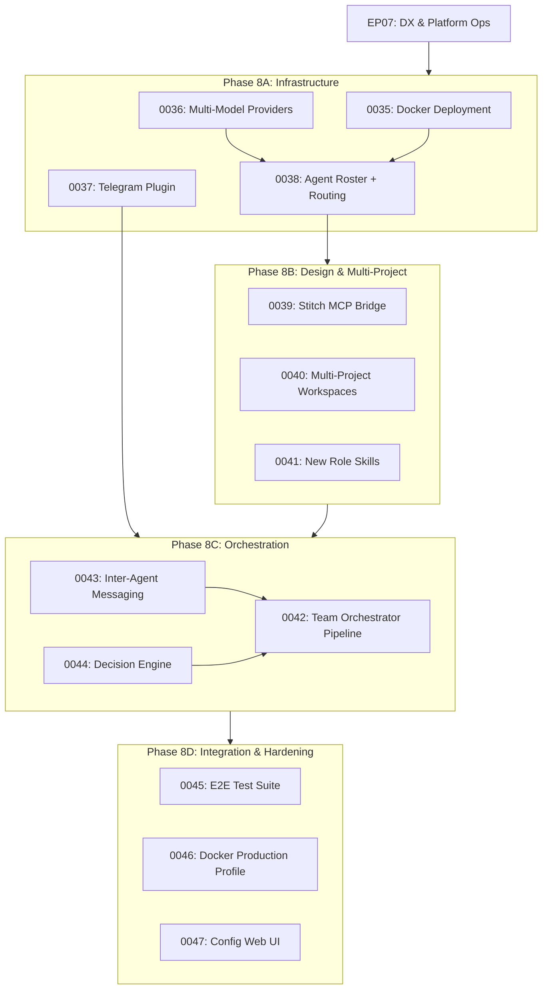

# EP08 -- Autonomous Product Team

| Field       | Value                                                    |
|-------------|----------------------------------------------------------|
| Epic        | EP08                                                     |
| Status      | PENDING                                                  |
| Priority    | P0                                                       |
| Phase       | 8 -- Autonomous Product Team                             |
| Target      | Q2 2026                                                  |
| Depends on  | EP07 (DX & Platform Ops)                                 |
| Blocks      | None                                                     |

## Goal

Deploy a fully autonomous product team of 10 AI agents running inside an
OpenClaw gateway in Docker, with per-agent model configuration (GPT 5.3,
Opus 4.6, GPT 4.1, Gemini 3, Sonnet 4.6), Stitch MCP integration for design,
Telegram channel for human oversight, a web UI for configuration, and multi-
project support. The team must be able to take a product idea from roadmap
definition to merged pull request without human intervention, while posting
progress updates to a Telegram group where the human operator can observe and
optionally intervene.

## Context

Phases 1-7 built the foundation:
- **EP01-EP02**: OpenClaw gateway + task engine with SQLite persistence
- **EP03**: Contract-driven workflow execution with JSON schema validation
- **EP04**: GitHub automation (branches, PRs, labels, CI webhooks)
- **EP05**: Quality gates, observability, structured logging
- **EP06**: Security hardening, cost tracking, concurrency limits
- **AR01**: Audit remediation (security, quality, architecture)
- **EP07**: DX tooling (scaffolding CLI, npm publish, CI quality gate)

The existing product-team plugin has 17 tools across task lifecycle, workflow,
quality, and VCS categories. Six agent roles (pm, architect, dev, qa, reviewer,
infra) are defined with tool allow-lists. What's missing is:

1. **Multi-model routing** — all agents currently use the same model
2. **Expanded agent roster** — need PM, Tech Lead, PO, Designer, 2 Backend, 2 Frontend, 1 QA, 1 DevOps
3. **Telegram channel integration** — human visibility into agent activity
4. **Stitch MCP integration** — designer agent produces Figma/Stitch designs
5. **Docker deployment** — isolated instance with dedicated ports, no collisions
6. **Web UI configuration** — manage team, models, and projects from browser
7. **Multi-project support** — agents can work on any repo, not just vibe-flow
8. **Inter-agent messaging** — agents can communicate beyond task metadata
9. **Autonomous workflow orchestration** — end-to-end roadmap → PR pipeline

## Architecture Overview

```
┌──────────────────────────────────────────────────────────┐
│                    Docker Container                       │
│                  (port 28789 → gateway)                   │
│                                                          │
│  ┌─────────────────────────────────────────────────────┐ │
│  │              OpenClaw Gateway                        │ │
│  │  ┌───────────┐ ┌─────────┐ ┌────────────────────┐  │ │
│  │  │ Control UI│ │Telegram │ │  Webhook Routes    │  │ │
│  │  │ :28789/   │ │ Channel │ │  /webhooks/github  │  │ │
│  │  └───────────┘ └─────────┘ └────────────────────┘  │ │
│  │                                                     │ │
│  │  ┌─────────────────────────────────────────────┐   │ │
│  │  │          Model Router Plugin                │   │ │
│  │  │  PM→GPT-5.3  TL→Opus-4.6  PO→GPT-4.1     │   │ │
│  │  │  Designer→Gemini-3  Devs→Sonnet-4.6       │   │ │
│  │  └─────────────────────────────────────────────┘   │ │
│  │                                                     │ │
│  │  ┌─────────────────────────────────────────────┐   │ │
│  │  │         Product Team Plugin                 │   │ │
│  │  │  task.* │ workflow.* │ quality.* │ vcs.*   │   │ │
│  │  │  ┌──────────────────────────────────────┐   │   │ │
│  │  │  │         Team Orchestrator            │   │   │ │
│  │  │  │  Roadmap→Tasks→Design→Code→QA→PR    │   │   │ │
│  │  │  └──────────────────────────────────────┘   │   │ │
│  │  └─────────────────────────────────────────────┘   │ │
│  │                                                     │ │
│  │  ┌─────────────────────────────────────────────┐   │ │
│  │  │        Stitch MCP Bridge Plugin             │   │ │
│  │  │  design.generate │ design.edit │ design.get │   │ │
│  │  └─────────────────────────────────────────────┘   │ │
│  │                                                     │ │
│  │  ┌─────────────────────────────────────────────┐   │ │
│  │  │        Telegram Notifier Plugin             │   │ │
│  │  │  Broadcasts task transitions, PR links,     │   │ │
│  │  │  design previews, quality reports to group   │   │ │
│  │  └─────────────────────────────────────────────┘   │ │
│  └─────────────────────────────────────────────────────┘ │
│                                                          │
│  ┌──────────────┐  ┌──────────────────────────────────┐ │
│  │ SQLite DB    │  │ Project Workspaces               │ │
│  │ (persistent  │  │ /workspaces/<project>/           │ │
│  │  volume)     │  │   - git clones                   │ │
│  └──────────────┘  └──────────────────────────────────┘ │
└──────────────────────────────────────────────────────────┘
                           │
              ┌────────────┼────────────┐
              ▼            ▼            ▼
        ┌──────────┐ ┌──────────┐ ┌──────────┐
        │ Telegram │ │  GitHub  │ │  Stitch  │
        │  Group   │ │   API    │ │   MCP    │
        └──────────┘ └──────────┘ └──────────┘
```

## Port Allocation

| Service                          | Port  | Notes                           |
|----------------------------------|-------|---------------------------------|
| Existing OpenClaw (WSL desktop)  | 18789 | DO NOT TOUCH                    |
| Docker OpenClaw Gateway          | 28789 | Web UI + API                    |
| Docker Gateway WebSocket         | 28790 | Agent WS connections            |
| Docker Stitch MCP Proxy          | 28791 | Internal only (in container)    |

## Agent Roster (10 agents)

| ID          | Role                 | Model                        | Responsibilities                                                    |
|-------------|----------------------|------------------------------|---------------------------------------------------------------------|
| `pm`        | Product Manager      | `openai/gpt-5.3`            | Roadmap definition, feature prioritization, stakeholder comms       |
| `tech-lead` | Tech Lead            | `anthropic/claude-opus-4.6`  | Task decomposition, architecture decisions, code review final say   |
| `po`        | Product Owner        | `openai/gpt-4.1`            | User story refinement, acceptance criteria, scope negotiation       |
| `designer`  | UI/UX Designer       | `google/gemini-3-pro`        | Stitch designs, design system, component specs, responsive layouts  |
| `back-1`    | Backend Dev (Senior) | `anthropic/claude-sonnet-4.6`| API implementation, database design, server-side logic              |
| `back-2`    | Backend Dev (Junior) | `anthropic/claude-sonnet-4.6`| Backend features, tests, documentation                              |
| `front-1`   | Frontend Dev (Senior)| `anthropic/claude-sonnet-4.6`| React/Next.js components, state management, Stitch→code            |
| `front-2`   | Frontend Dev (Junior)| `anthropic/claude-sonnet-4.6`| UI components, CSS, responsive implementation                       |
| `qa`        | QA Engineer          | `anthropic/claude-sonnet-4.6`| Test plans, test execution, regression suites, quality reports      |
| `devops`    | DevOps Engineer      | `anthropic/claude-sonnet-4.6`| CI/CD, GitHub automation, deployment, infrastructure as code        |

## Autonomous Workflow Pipeline

```
Human posts idea in Telegram
         │
         ▼
    PM receives idea → creates roadmap item
         │
         ▼
    PM breaks roadmap item into epics
         │
         ▼
    PO refines each epic into user stories with acceptance criteria
         │
         ▼
    Tech Lead decomposes stories into technical tasks
         │
         ▼
    Designer creates Stitch designs for UI tasks
         │
         ▼
    Tech Lead assigns tasks to dev agents
         │
         ▼
    Devs implement (Backend & Frontend in parallel)
         │
         ▼
    QA runs automated test suites
         │
         ▼
    Tech Lead reviews code
         │
         ▼
    DevOps creates PR, manages CI
         │
         ▼
    All status updates → Telegram group
```

## Tasks

### Phase 8A: Infrastructure (Docker + Telegram)

#### 8A.1 Docker Deployment Configuration (Task 0035)
Create Dockerfile, docker-compose.yml, and environment configuration for running
an isolated OpenClaw gateway instance. Must use port 28789 to avoid collision
with the existing WSL instance on 18789. Persistent volumes for SQLite DB and
project workspaces. Node 22 base image with pnpm.

#### 8A.2 Multi-Model Provider Configuration (Task 0036)
Configure the OpenClaw gateway with multiple LLM providers: OpenAI (GPT-5.3,
GPT-4.1), Anthropic (Claude Opus 4.6, Claude Sonnet 4.6), and Google (Gemini 3
Pro). Set up OAuth/API-key authentication for each provider. Configure fallback
chains per agent.

#### 8A.3 Telegram Channel Integration Plugin (Task 0037)
Build a plugin that bridges OpenClaw agent activity to a Telegram group. The
plugin listens to lifecycle hooks (task transitions, PR creation, quality gate
results, agent errors) and posts formatted updates to the Telegram group. Also
accepts human commands from Telegram to intervene in the workflow.

#### 8A.4 Expanded Agent Roster with Per-Agent Model Routing (Task 0038)
Expand the current 6-agent roster to 10 agents with the full role breakdown.
Configure per-agent model assignments using the `before_model_resolve` hook.
Define tool allow-lists for each new role (tech-lead, po, designer, back-1/2,
front-1/2, devops). Update skills to match new roles.

### Phase 8B: Design & Multi-Project

#### 8B.1 Stitch MCP Bridge Plugin (Task 0039)
Create a plugin that registers design tools (`design.generate`, `design.edit`,
`design.get`, `design.list`) by proxying to the Stitch MCP endpoint at
`https://stitch.googleapis.com/mcp`. The designer agent uses these tools to
create screen designs before frontend implementation begins. Downloaded designs
are stored in `.stitch-html/` per project workspace.

#### 8B.2 Multi-Project Workspace Manager (Task 0040)
Extend the product-team plugin to support multiple project workspaces. Each
project gets its own git clone, configuration (GitHub owner/repo, branch
conventions), and isolated task database. Projects are registered via config or
API. Agents switch project context via a `project.switch` tool.

#### 8B.3 New Skills for Expanded Roles (Task 0041)
Create SKILL.md files for the new agent roles: tech-lead (task decomposition,
architecture review, code review), product-owner (story refinement, acceptance
criteria, scope), ui-designer (Stitch workflow, design system, component specs),
frontend-dev (React/Next.js, Stitch→code translation), backend-dev (API design,
database, server logic), devops (CI/CD, deployment, infrastructure).

### Phase 8C: Autonomous Orchestration

#### 8C.1 Team Orchestrator — Roadmap-to-Task Pipeline (Task 0042)
Build the autonomous pipeline that takes a product idea (from Telegram or API)
and drives it through the full lifecycle: PM creates roadmap → PO refines
stories → Tech Lead creates tasks → Designer creates designs → Devs implement →
QA tests → Tech Lead reviews → DevOps ships. The orchestrator manages handoffs
between agents using task transitions and inter-agent messages.

#### 8C.2 Inter-Agent Messaging System (Task 0043)
Implement a messaging layer that allows agents to send direct messages to each
other for clarifications, questions, and coordination beyond the structured task
metadata. Messages are logged to the event log for auditability. Urgent messages
(blockers, failed gates) are forwarded to Telegram.

#### 8C.3 Autonomous Decision Engine (Task 0044)
Build the decision engine that allows agents to make autonomous choices when
facing ambiguity: which tasks to parallelize, when to escalate to Tech Lead,
when to notify the human on Telegram, how to handle failing tests, how to
resolve conflicting requirements. Configurable escalation policies.

### Phase 8D: Integration Testing & Hardening

#### 8D.1 End-to-End Integration Test Suite (Task 0045)
Build a comprehensive test suite that validates the full pipeline: idea →
roadmap → tasks → design → implementation → quality gates → PR → merge. Mock
external services (GitHub API, Stitch MCP, Telegram) for reproducible testing.
Test agent handoffs, error recovery, and escalation paths.

#### 8D.2 Docker Compose Production Profile (Task 0046)
Create production-ready docker-compose profile with: health checks, log
aggregation, resource limits per agent, automatic restart policies, volume
backup strategy, secrets management via Docker secrets or environment files,
monitoring endpoints for the Telegram health check plugin.

#### 8D.3 Configuration Web UI Extension (Task 0047)
Extend the OpenClaw Control UI with a configuration panel for the autonomous
team: manage projects, assign models to agents, configure Telegram settings,
view agent activity dashboard, set escalation policies, manage quality gate
thresholds. Served from the gateway's built-in Control UI infrastructure.

## Dependency Graph



## Risk Register

| Risk | Impact | Probability | Mitigation |
|------|--------|-------------|------------|
| Model API rate limits at scale | HIGH | MEDIUM | Implement request queuing with backpressure; configure per-agent rate limits; use fallback models on 429 |
| Token cost overruns with 10 agents | HIGH | HIGH | Per-agent budget caps (from EP06); cost dashboard in Telegram; auto-pause on budget breach |
| Agent loops (infinite task ping-pong) | HIGH | MEDIUM | Circuit breaker in orchestrator; max rounds per task; escalate to human after N iterations |
| Docker networking issues with WSL | MEDIUM | MEDIUM | Use bridge network; explicit port binding; health check endpoints; document WSL-specific gotchas |
| Stitch MCP availability/rate limits | MEDIUM | LOW | Cache designs locally; retry with backoff; designer agent can describe design in text as fallback |
| Telegram API rate limits | LOW | LOW | Batch messages; use message queuing; respect Telegram's 30 msg/sec per bot limit |
| Model quality variance across providers | MEDIUM | HIGH | Benchmark each role's model; swap models if quality issues; keep fallback chains |

## Success Criteria

1. Docker container boots with `docker compose up` and gateway is accessible at `localhost:28789`
2. All 10 agents are reachable and respond with their role-appropriate model
3. A product idea posted in Telegram triggers the full pipeline autonomously
4. Designer agent produces Stitch designs that frontend agents consume
5. Quality gates block bad transitions (no regression from EP05/EP06)
6. All agent activity is visible in the Telegram group
7. The human can intervene via Telegram commands at any point
8. Multiple projects can be configured and switched between
9. Cost tracking and budget limits work across all 10 agents
10. End-to-end test suite passes with mocked external services

## References

- [OpenClaw Plugin SDK](../extension-integration.md) — plugin API capabilities
- [ADR-001](../adr/ADR-001-migrate-from-mcp-to-openclaw.md) — why OpenClaw over MCP
- [EP02 Task Engine](EP02-task-engine.md) — TaskRecord lifecycle (foundation)
- [EP03 Role Execution](EP03-role-execution.md) — workflow step runner, schemas
- [EP06 Hardening](EP06-hardening.md) — cost tracking, concurrency limits
- Stitch MCP: `https://stitch.googleapis.com/mcp` (Google Stitch design tool)
- OpenClaw Telegram channel: built-in `grammy` integration
