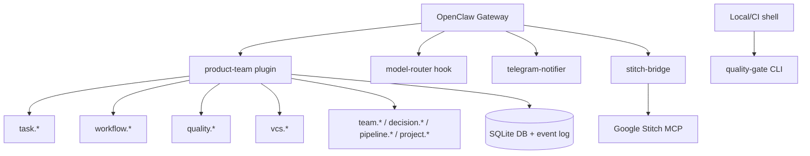

# Extension Integration Patterns

How the six extensions coexist in the current architecture.

## Current Topology



```
OpenClaw Gateway (port 28789)
  -> product-team plugin (35 tools, 10 hooks, SQLite persistence)
      -> Task lifecycle tools (task.*)
      -> Workflow tools (workflow.*)
      -> Quality tools (quality.*)
      -> VCS tools (vcs.*)
      -> Team messaging tools (team.*)
      -> Decision engine (decision.*)
      -> Pipeline orchestrator (pipeline.*)
      -> Project manager (project.*)
      -> SQLite persistence + event log

  -> model-router hook (per-agent model routing from config)
  -> telegram-notifier (lifecycle → Telegram group notifications)
  -> stitch-bridge (Google Stitch MCP proxy for designer agent)

Local/CI Shell
  -> quality-gate CLI (pnpm q:gate / pnpm q:tests / pnpm q:coverage / ...)
      -> standalone quality execution against workspace artifacts
```

`openclaw.docker.json` loads all 6 extensions.
`openclaw.json` (local dev) loads only `extensions/product-team`.

## Responsibility Split

| Area | product-team | quality-gate | model-router | telegram-notifier | stitch-bridge |
|---|---|---|---|---|---|
| OpenClaw runtime tools | 34 tools | No (CLI only) | No | No | 4 tools (design.*) |
| Task metadata writes | Yes | No | No | No | No |
| Transition guard support | Yes | No | No | No | No |
| Standalone quality CLI | No | Yes | No | No | No |
| Model routing hooks | No | No | Yes | No | No |
| Telegram notifications | No | No | No | Yes | No |
| Design tool proxy | No | No | No | No | Yes |

## Metadata Integration (Runtime)

In `product-team`, quality tools write directly into `TaskRecord.metadata`:

- `quality.tests` -> `metadata.qa_report` and `metadata.quality.tests`
- `quality.coverage` -> `metadata.dev_result.metrics.coverage` and `metadata.quality.coverage`
- `quality.lint` -> `metadata.dev_result.metrics.lint_clean` and `metadata.quality.lint`
- `quality.complexity` -> `metadata.complexity` and `metadata.quality.complexity`
- `quality.gate` -> `metadata.quality.gate`

This removes manual copy steps between quality execution and transition guard
evaluation.

## Guard-Evidence Interaction

Transition guards evaluate task metadata directly:

- `design -> in_progress` reads `architecture_plan`
- `in_progress -> in_review` reads `dev_result.metrics.*` plus `red_green_refactor_log`
- `in_review -> qa` reads `review_result`
- `qa -> done` reads `qa_report`

Quality tools provide metrics fields; role outputs are provided through
`workflow.step.run` (or `task.update` where appropriate).

## Operational Guidance

Use `product-team` quality tools when evidence must be persisted to tasks and
used by guards.

Use `quality-gate` CLI when you need standalone quality execution in local/CI
pipelines without task-engine state.
