```mermaid
graph TD
  EP01[EP01: OpenClaw Foundation]
  EP02[EP02: Task Engine]
  EP03[EP03: Role Execution] --> EP02
  EP04[EP04: GitHub Integration] --> EP02
  EP05[EP05: Quality & Observability] --> EP02
  EP05 --> EP03
  EP06[EP06: Hardening] --> EP03
  EP06 --> EP04
  AR01[AR01: Audit Remediation Program] --> EP06
  EP07[EP07: DX & Platform Ops] --> AR01
  EP08[EP08: Autonomous Product Team] --> EP07
  EP09[EP09: Pipeline Intelligence & Reliability] --> EP08

  %% Phase 10: Adaptive Intelligence
  EP10[EP10: Dynamic Model Routing] --> EP09
  EP11[EP11: Budget Intelligence] --> EP09
  EP12[EP12: Agent Learning Loop] --> EP10
  EP12 --> EP11

  %% Phase 11: Protocol & Communication
  EP13[EP13: Stable Agent Protocol] --> EP09
  EP14[EP14: Local-First Observability] --> EP09
  EP15[EP15: Telegram Control Plane v2] --> EP14

  %% Phase 12: Quality at Scale
  EP16[EP16: E2E Testing & Load] --> EP13
  EP17[EP17: Security & Stability v2] --> EP09

  %% Phase 13: Reference & Community
  EP18[EP18: Plugin SDK Contracts & DX] --> EP13
  EP18 --> EP16
  EP19[EP19: Showcase & Documentation] --> EP18

  %% Styling
  style EP10 fill:#e1f5fe
  style EP11 fill:#e1f5fe
  style EP12 fill:#e1f5fe
  style EP13 fill:#fff3e0
  style EP14 fill:#fff3e0
  style EP15 fill:#fff3e0
  style EP16 fill:#e8f5e9
  style EP17 fill:#e8f5e9
  style EP18 fill:#f3e5f5
  style EP19 fill:#f3e5f5
```

# Roadmap -- OpenClaw Product Team Extensions

> Last updated: 2026-03-08

## Vision

A fully autonomous **product-team** of 8 AI agents (PM, Tech Lead, PO, Designer,
Backend Dev, Frontend Dev, QA, DevOps) operating inside the OpenClaw gateway.
Each agent owns a well-defined slice of the software delivery lifecycle,
communicates through inter-agent messaging, and is governed by tool-policy
allow-lists and a decision engine with escalation policies.

### Vision v2: Reference Architecture for Autonomous Agent Teams

Phases 1-9 built a **functional** autonomous team. Phases 10-13 make it a
**reference implementation** that demonstrates best practices for multi-agent
systems: adaptive intelligence, formal communication protocols, production-grade
observability, and extensibility for the community.

**Strategic axes (priority order):**

1. **Intelligence** -- Agents that optimize their own resource usage, learn from
   outcomes, and adapt routing to budget constraints.
2. **Communication** -- From ad-hoc messaging to formal protocols with contracts,
   versioning, and full traceability.
3. **Scale** -- Quality gates and testing infrastructure that grow with the system.
4. **Distribution** -- SDK stability, documentation, and showcase materials that
   turn this into a project others can learn from and build upon.

**Constraints:**

- **Budget-limited** -- LLM tokens are scarce; copilot-proxy free-tier fallbacks
  are essential. Dynamic routing is a survival feature, not a nice-to-have.
- **Local-first** -- No cloud staging. Docker + local gateway is the deployment model.
- **OpenClaw extension** -- Build on the SDK, don't fight it.
- **Open-source** -- Already public, seeking community traction.

---

## Execution Order

| Phase | Epic | Description                          | Dependencies | Target     | Status  |
|-------|------|--------------------------------------|--------------|------------|---------|
| 1     | EP01 | OpenClaw Foundation                  | None         | March 2026 | DONE    |
| 1     | EP02 | Task Engine                          | None         | March 2026 | DONE    |
| 2     | EP03 | Role Execution                       | EP02         | March 2026 | DONE    |
| 3     | EP04 | GitHub Integration                   | EP02         | March 2026 | DONE    |
| 4     | EP05 | Quality & Observability              | EP02, EP03   | March 2026 | DONE    |
| 5     | EP06 | Hardening                            | EP03, EP04   | March 2026 | DONE    |
| 6     | AR01 | Audit Remediation Program            | EP06         | March 2026 | DONE    |
| 7     | EP07 | DX & Platform Ops                    | AR01         | March 2026 | DONE    |
| 8     | EP08 | Autonomous Product Team              | EP07         | March 2026 | DONE    |
| 9     | EP09 | Pipeline Intelligence & Reliability  | EP08         | March 2026 | DONE    |
| 10    | EP10 | Dynamic Model Routing                | EP09         | March 2026 | PENDING |
| 10    | EP11 | Budget Intelligence                  | EP09         | March 2026 | PENDING |
| 10    | EP12 | Agent Learning Loop                  | EP10, EP11   | April 2026 | PENDING |
| 11    | EP13 | Stable Agent Protocol                | EP09         | April 2026 | PENDING |
| 11    | EP14 | Local-First Observability            | EP09         | April 2026 | PENDING |
| 11    | EP15 | Telegram Control Plane v2            | EP14         | April 2026 | PENDING |
| 12    | EP16 | E2E Testing & Load Characterization  | EP13         | May 2026   | PENDING |
| 12    | EP17 | Security & Stability v2              | EP09         | May 2026   | PENDING |
| 13    | EP18 | Plugin SDK Contracts & DX            | EP13, EP16   | June 2026  | PENDING |
| 13    | EP19 | Showcase & Documentation             | EP18         | June 2026  | PENDING |

---

## Phase 1: Foundation (March 2026)

### EP01 -- OpenClaw Foundation

Set up the OpenClaw gateway with authentication, multi-agent routing by role,
and tool policies that restrict each agent to its authorized surface area.

Key deliverables:

- Gateway configuration and startup
- Agent definitions for all six roles (pm, architect, dev, qa, reviewer, infra)
- Tool allow-list policies per role
- Sandbox / environment configuration
- Smoke tests verifying gateway boots and routes correctly

### EP02 -- Task Engine

Build the core TaskRecord lifecycle with SQLite persistence, a strict state
machine, an append-only event log, and lease-based ownership.

Key deliverables:

- Plugin scaffold (`extensions/product-team`)
- TaskRecord domain model (title, status, scope, assignee, metadata)
- SQLite persistence layer with migrations
- State machine with validated transitions
- Event log table for full audit trail
- Lease mechanism for exclusive task ownership
- Tool registration: `task.create`, `task.get`, `task.search`, `task.update`,
  `task.transition`

---

## Phase 2: Role Execution (April 2026)

### EP03 -- Role Execution

Introduce contract-driven workflow execution where each role produces a
validated JSON output conforming to its schema.

Key deliverables:

- JSON schemas per role (po_brief, architecture_plan, dev_result, qa_report,
  review_result)
- Step runner supporting `llm-task` and custom steps
- Quality gate integration (coverage, lint, complexity thresholds)
- FastTrack system for minor-scope tasks that skip architecture review

---

## Phase 3: GitHub Integration (May--June 2026)

### EP04 -- GitHub Integration

Automate branch creation, pull-request management, labelling, and CI feedback
with idempotent request tracking to avoid duplicate operations.

Key deliverables:

- GitHub operations wrapper over `gh` CLI (via `safeSpawn`)
- VCS tool registration (`vcs.branch.create`, `vcs.pr.create`, `vcs.pr.update`,
  `vcs.label.sync`)
- PR-Bot skill for standard PR workflows
- CI webhook feedback (status checks, comments)
- Idempotency keys to prevent duplicate branches/PRs

---

## Phase 4: Quality & Observability (July 2026)

### EP05 -- Quality & Observability

Enforce quality gates as first-class workflow steps and provide visibility into
agent activity through dashboards and structured logging.

Key deliverables:

- Quality tools consolidation (merge `quality-gate` into `product-team`)
- Gate enforcement at state transitions
- Event log dashboard (`workflow.events.query` tool)
- Structured logging (JSON with correlation IDs)

---

## Phase 5: Hardening (August 2026)

### EP06 -- Hardening

Prepare the system for production use with security hardening, cost controls,
concurrency safeguards, and comprehensive documentation.

Key deliverables:

- Tool allow-list audit and tightening
- Cost tracking (LLM tokens + agent wall-clock time per task)
- Per-task budget limits (configurable)
- Secrets management review (DB path validation, no secrets in metadata/logs)
- Concurrency limits (max parallel tasks per agent)
- Runbook for operators
- End-to-end walkthrough documentation

---

## Phase 6: Audit Remediation Program (Q1 2026)

### AR01 -- Post-Audit Remediation Execution

Execute remediation work derived from the 2026-02-25 comprehensive audit in a
controlled queue, preserving strict traceability from finding to task and
walkthrough evidence.

Execution lanes:

- Product contract restoration: command surface and config contract alignment.
- Security hardening and policy enforcement: webhook authenticity, audit gating,
  dependency risk handling.
- Architecture and maintainability convergence: shared quality logic, lifecycle
  reliability, and test/coverage quality.

---

## Phase 7: DX & Platform Ops (Q2 2026)

### EP07 -- DX & Platform Ops

Improve developer experience and operational readiness: automated extension scaffolding,
a reproducible npm publish pipeline, and a full quality-gate feedback loop on pull requests.

Key deliverables:

- Extension scaffolding CLI (`pnpm create:extension <name>`)
- npm publish pipeline for `@openclaw/*` packages with provenance and OIDC
- CI quality gate workflow with PR comment upsert and merge-blocking status checks

---

## Phase 8: Autonomous Product Team (Q2 2026)

### EP08 -- Autonomous Product Team

Deploy a fully autonomous product team of 8 AI agents running inside an
OpenClaw gateway in Docker, with per-agent model routing, Stitch MCP
integration, Telegram channel for human oversight, a web UI for configuration,
and multi-project support.

Key deliverables:

- Docker deployment isolated from existing WSL gateway (port 28789)
- Multi-model provider config (OpenAI, Anthropic, Google AI)
- Telegram channel integration plugin
- Expanded 8-agent roster with per-agent model routing
- Stitch MCP bridge for designer agent
- Multi-project workspace manager
- New role skills (tech-lead, po, designer, backend-dev, frontend-dev, devops)
- Team orchestrator pipeline (roadmap → PR)
- Inter-agent messaging system
- Autonomous decision engine
- End-to-end integration test suite
- Docker Compose production profile
- Configuration web UI extension

---

## Phase 9: Pipeline Intelligence & Reliability (Q2-Q3 2026)

### EP09 -- Pipeline Intelligence & Reliability

Close the gap between EP08's infrastructure (agents, messaging, pipeline tools) and
truly autonomous operation. EP08 deployed the team and gave it tools to track stages
and make decisions. EP09 makes the pipeline self-driving: automatic stage advancement,
enforced timeouts and retry limits, spawn failure recovery, decision outcome learning,
and per-stage metrics that enable continuous improvement.

Key deliverables:

- Automatic pipeline stage advancement driven by the orchestrator loop
- Stage timeout enforcement with escalation (using existing config values)
- Spawn failure recovery: retry queue with dead-letter alerting
- Decision engine fixes: per-agent circuit breaker, maxRetries enforcement, timeout enforcement
- Decision outcome tracking and feedback loop (was the auto-decision later overridden?)
- Per-stage metrics: duration, token cost, retry count, quality gate results
- Pipeline state promotion to indexed DB column (efficient stage-based queries)
- Spawn abstraction layer to decouple from OpenClaw SDK internals
- Per-persona Telegram bot routing for remaining agents (po, qa, devops)

---

## Phase 10: Adaptive Intelligence (March 2026)

> The dumb agent burns tokens. The intelligent agent invests them.

Phase 10 is the highest-priority work. With limited LLM budget and copilot-proxy
free-tier fallbacks as the primary escape hatch, dynamic routing is a survival
feature. This phase makes every token count.

### EP10 -- Dynamic Model Routing

Activate the `before_model_resolve` hook in the model-router extension to enable
per-request routing based on task complexity, accumulated cost, provider health,
and fallback chains. The static `agents.list[].model` config becomes the default;
the dynamic resolver overrides it when conditions warrant.

**Why now:** The model-router extension already exists with the hook commented out,
the provider health endpoint is live, and auth-profiles support copilot-proxy.
All the pieces are in place — this epic wires them together.

Key deliverables:

- Task complexity scoring engine
- Provider health integration with automatic failover
- Dynamic model resolver hook (`before_model_resolve`)
- Cost-aware routing with budget-threshold downgrade
- Fallback chain resolution with copilot-proxy support

#### Tasks

- Task 0079: Task Complexity Scoring Engine -- DONE (EP10, 10A)
- Task 0080: Provider Health Integration for Routing -- PENDING (EP10, 10A)
- Task 0081: Dynamic Model Resolver Hook -- PENDING (EP10, 10B)
- Task 0082: Cost-Aware Model Tier Downgrade -- PENDING (EP10, 10B)
- Task 0083: Fallback Chain with Copilot-Proxy Resolution -- PENDING (EP10, 10C)

### EP11 -- Budget Intelligence

Transform budget tracking from soft warnings into hard enforcement with real-time
visibility. Today, cost tracking writes to the event log and budget limits are
advisory. This epic makes budget a first-class constraint that actively shapes
pipeline execution decisions.

**Why now:** Limited token budget means every pipeline run risks exhausting
resources. Hard limits prevent runaway costs. The Telegram `/budget` command
currently returns a stub — users need real visibility.

Key deliverables:

- Hard budget limits per pipeline and per agent
- Real-time budget consumption tracking
- Automatic model tier downgrade on budget threshold
- Telegram `/budget` real-time dashboard
- Budget forecasting and alerting

#### Tasks

- Task 0084: Hard Budget Limits Engine -- PENDING (EP11, 10A)
- Task 0085: Per-Agent Budget Tracking and Enforcement -- PENDING (EP11, 10A)
- Task 0086: Budget-Triggered Model Tier Auto-Downgrade -- PENDING (EP11, 10B)
- Task 0087: Telegram /budget Real-Time Dashboard -- PENDING (EP11, 10B)
- Task 0088: Budget Forecasting and Overspend Alerting -- PENDING (EP11, 10C)

### EP12 -- Agent Learning Loop

Close the feedback loop between decision outcomes and future behavior. EP09
added decision outcome tracking (task 0071) — EP12 reads those outcomes and
uses them to improve routing, escalation policies, and template selection.
This is not ML; it is rule-based pattern detection over structured event data.

**Why now:** The decision engine already logs outcomes (success/overridden/failed).
The data exists but nobody reads it. EP12 turns passive logging into active
learning. Depends on EP10 (routing) and EP11 (budget) to have the levers to pull.

Key deliverables:

- Decision outcome pattern analyzer
- Adaptive escalation policies based on outcome history
- Agent performance scoring (model × task-type success rates)
- Dynamic template pre-loading from historical outputs
- Routing feedback integration with EP10's model resolver

#### Tasks

- Task 0089: Decision Outcome Pattern Analyzer -- PENDING (EP12, 10A)
- Task 0090: Adaptive Escalation Policy Engine -- PENDING (EP12, 10A)
- Task 0091: Agent-Model Performance Scorer -- PENDING (EP12, 10B)
- Task 0092: Dynamic Template Pre-Loading -- PENDING (EP12, 10B)
- Task 0093: Routing Feedback Loop Integration -- PENDING (EP12, 10C)

---

## Phase 11: Protocol & Communication (April 2026)

> From ad-hoc messages to formal contracts.

Phase 11 stabilizes the communication layer. The spawn mechanism depends on
minified SDK internals that can break on any OpenClaw update. The Telegram
plugin uses a brittle `_sharedDb` cast. Inter-agent messages lack formal
schemas. This phase fixes all of that.

### EP13 -- Stable Agent Protocol

Replace fragile SDK internal dependencies with a stable, versioned protocol
for agent communication. Define formal request/response contracts between
agents. Make the system resilient to OpenClaw SDK updates.

**Why now:** The spawn abstraction layer (EP09 task 0067) decoupled the
_interface_ but still relies on discovered SDK internals (`clientMod.t`,
`clientMod.kt`, `clientMod.Xt`). One SDK update can break all agent spawning.
The `_sharedDb` cast in the Telegram plugin is equally fragile. This is
technical debt with high blast radius.

Key deliverables:

- Spawn mechanism v2 with zero SDK internal dependencies
- Formal inter-agent message contracts (JSON Schema validated)
- Stable shared database access pattern (replace `_sharedDb` cast)
- Protocol version negotiation between agents
- Contract-first communication testing

#### Tasks

- Task 0094: Spawn Mechanism v2 -- Zero SDK Internals -- PENDING (EP13, 11A)
- Task 0095: Inter-Agent Message Contracts (JSON Schema) -- PENDING (EP13, 11A)
- Task 0096: Stable Plugin Shared State API -- PENDING (EP13, 11B)
- Task 0097: Protocol Version Negotiation -- PENDING (EP13, 11B)
- Task 0098: Contract Conformance Test Suite -- PENDING (EP13, 11C)

### EP14 -- Local-First Observability

Build observability that runs entirely on local infrastructure (SQLite + HTTP
endpoints + Telegram). No Prometheus, no Grafana, no external services. The
event log already captures everything — this epic builds the aggregation and
query layer on top.

**Why now:** When something goes wrong in the pipeline, diagnosis requires
reading raw SQLite event log rows. There is no dashboard, no health summary,
no way to answer "what happened in the last hour?" without writing SQL. The
Telegram `/health` command returns a stub.

Key deliverables:

- Aggregated metrics store (SQLite materialized views over event log)
- `/api/metrics` HTTP endpoint with system health JSON
- `/api/timeline` HTTP endpoint with pipeline execution timeline
- Structured logging consolidation with guaranteed correlation IDs
- Agent activity heatmap (who did what, when, how long)

#### Tasks

- Task 0099: Metrics Aggregation Engine (SQLite) -- PENDING (EP14, 11A)
- Task 0100: /api/metrics System Health Endpoint -- PENDING (EP14, 11A)
- Task 0101: /api/timeline Pipeline Execution Endpoint -- PENDING (EP14, 11B)
- Task 0102: Structured Logging Consolidation -- PENDING (EP14, 11B)
- Task 0103: Agent Activity Heatmap -- PENDING (EP14, 11C)

### EP15 -- Telegram Control Plane v2

Transform Telegram from a notification channel into a full control plane.
Complete the three stub commands, add pipeline visualization, rich approval
workflows with inline context, and proactive alerting.

**Why now:** Telegram is the only human interface to the autonomous team.
Three of its seven commands return stubs. Approval workflows lack context
(approving a decision without seeing the diff is guessing). The human
operator deserves a proper control surface.

Depends on EP14 for the metrics and health data that feeds the dashboards.

Key deliverables:

- `/teamstatus` -- live agent status with current task and pipeline stage
- `/health` -- real-time system diagnostics from EP14 metrics
- `/budget` -- real-time budget dashboard from EP11 data
- `/pipeline` -- active pipeline visualization with stage times
- Rich approval workflows with inline diff/quality context
- Proactive alerting (timeout warnings, budget approaching limit, stalled stages)

#### Tasks

- Task 0104: /teamstatus Live Agent Dashboard -- PENDING (EP15, 11A)
- Task 0105: /health Real-Time System Diagnostics -- PENDING (EP15, 11A)
- Task 0106: /pipeline Active Pipeline Visualization -- PENDING (EP15, 11B)
- Task 0107: Rich Approval Workflows with Inline Context -- PENDING (EP15, 11B)
- Task 0108: Proactive Alerting Engine -- PENDING (EP15, 11C)

---

## Phase 12: Quality at Scale (May 2026)

> The quality that got us here must scale with us.

Phase 12 ensures the testing and security infrastructure keeps pace with the
growing system complexity. 8 agents running in parallel on SQLite have never
been load-tested. The e2e test suite exists but does not run in CI. Security
scanning is manual.

### EP16 -- E2E Testing & Load Characterization

Activate end-to-end testing in CI and characterize the system under concurrent
multi-agent load. Establish performance baselines and CI guardrails that prevent
regressions.

**Why now:** The system has never been tested under realistic concurrent load.
The e2e suite (task 0045) exists but is not wired into CI. As we add intelligence
(phase 10) and protocol changes (phase 11), we need a safety net that catches
regressions across the full pipeline.

Depends on EP13 (stable protocol) because e2e tests should target the stable
protocol, not the fragile SDK internals.

Key deliverables:

- E2E pipeline test in CI (IDEA → DONE with LLM mocks)
- Concurrent agent load benchmark (8 agents, SQLite contention profiling)
- Protocol regression test suite (validates EP13 contracts under load)
- Performance baseline documentation and CI guardrails
- Bottleneck analysis report with remediation recommendations

#### Tasks

- Task 0109: E2E Pipeline Test with LLM Mocks in CI -- PENDING (EP16, 12A)
- Task 0110: Concurrent Agent Load Benchmark -- PENDING (EP16, 12A)
- Task 0111: Protocol Regression Test Suite -- PENDING (EP16, 12B)
- Task 0112: Performance Baseline and CI Guardrails -- PENDING (EP16, 12B)

### EP17 -- Security & Stability v2

Address the remaining security and stability gaps identified in prior audits
that were deferred or blocked. Add automated scanning, fix migration
brittleness, and resolve dependency version conflicts.

**Why now:** A project aspiring to be a reference implementation must have
zero known high-severity findings. Several items from the audit remediation
(task 0078) were blocked on infrastructure access. The dependency version
conflict (vitest ^3 vs ^4) creates sporadic test failures. DB migrations
have no rollback path.

Key deliverables:

- Secrets scanning in CI (gitleaks)
- Database migration rollback mechanism
- Vitest version alignment across all workspaces
- Coverage and complexity blocking enforcement in CI (D-008 resolution)
- Blocked infrastructure findings resolution (task 0078 follow-up)

#### Tasks

- Task 0113: Secrets Scanning in CI (Gitleaks) -- PENDING (EP17, 12A)
- Task 0114: Database Migration Rollback Mechanism -- PENDING (EP17, 12A)
- Task 0115: Vitest Version Alignment -- PENDING (EP17, 12B)
- Task 0116: Coverage/Complexity CI Blocking Policy -- PENDING (EP17, 12B)
- Task 0117: Blocked Infrastructure Findings Resolution -- PENDING (EP17, 12C)

---

## Phase 13: Reference & Community (June 2026)

> Make the project explain itself.

Phase 13 focuses on making vibe-flow a project that external developers can
understand, learn from, and extend. The codebase is solid — but with only
ADR-001, no visual architecture docs, and a minimal README, it is invisible
to the community.

### EP18 -- Plugin SDK Contracts & DX

Stabilize the public plugin API, document it with executable examples, wire
the existing npm publish pipeline, and enhance the extension scaffolding with
templates for common extension types.

**Why now:** The `create:extension` CLI (task 0032) and `publish-packages.mjs`
(task 0033) exist but are not connected end-to-end. The plugin API surface is
implicit (learned by reading index.ts files). For external contributors, there
is no "getting started" path.

Depends on EP13 (stable protocol) because the SDK documentation must describe
stable contracts, not fragile internals. Depends on EP16 (e2e tests) to
validate that scaffolded extensions pass the full test suite.

Key deliverables:

- Plugin API reference documentation with executable code examples
- npm publish pipeline end-to-end wiring (GitHub Actions → npm registry)
- Extension scaffolding templates by type (tool, hook, service, hybrid)
- Getting started guide: "Your first OpenClaw extension in 5 minutes"
- API versioning policy and deprecation strategy

#### Tasks

- Task 0118: Plugin API Reference Documentation -- PENDING (EP18, 13A)
- Task 0119: npm Publish Pipeline End-to-End Wiring -- PENDING (EP18, 13A)
- Task 0120: Extension Scaffolding Templates by Type -- PENDING (EP18, 13B)
- Task 0121: Getting Started Guide -- PENDING (EP18, 13B)
- Task 0122: API Versioning Policy and Deprecation Strategy -- PENDING (EP18, 13C)

### EP19 -- Showcase & Documentation

Create the materials that make vibe-flow a reference project: comprehensive
ADRs, architecture diagrams, a detailed case study of the autonomous pipeline,
and a README that demonstrates value in 30 seconds.

**Why now:** The project is already open-source but has zero community traction.
The code is good but invisible. Task 0077 (autonomous IDEA→PR) is a compelling
story that nobody outside this repo knows about. This epic tells that story.

Key deliverables:

- Architecture Decision Records (ADR-002 through ADR-010+)
- Task 0077 autonomous pipeline case study (IDEA → PR in detail)
- Architecture diagrams (Mermaid: system overview, pipeline flow, agent communication, hexagonal layers)
- README overhaul with visual showcase (screenshots, pipeline diagram, quick start)
- Technical blog post / article draft

#### Tasks

- Task 0123: ADR Backlog -- Key Architectural Decisions -- PENDING (EP19, 13A)
- Task 0124: Autonomous Pipeline Case Study (Task 0077) -- PENDING (EP19, 13A)
- Task 0125: Architecture Diagrams (Mermaid) -- PENDING (EP19, 13B)
- Task 0126: README Overhaul with Visual Showcase -- PENDING (EP19, 13B)
- Task 0127: Technical Article Draft -- PENDING (EP19, 13C)

---

---

## Risk Register

| Risk | Impact | Probability | Mitigation |
|------|--------|-------------|------------|
| OpenClaw API changes before 1.0 | HIGH | MEDIUM | Pin versions, abstract behind plugin API, EP13 removes SDK internals |
| SQLite concurrency under 8 parallel agents | HIGH | MEDIUM | WAL mode, lease-based locking, EP16 load benchmark |
| Token cost overruns exhaust limited budget | HIGH | HIGH | EP10 dynamic routing, EP11 hard budget limits, copilot-proxy fallbacks |
| Schema drift between roles | MEDIUM | LOW | Shared TypeBox schemas, CI validation |
| Spawn fragility from SDK internals | HIGH | HIGH | EP13 spawn v2 with zero SDK internals dependency |
| Silent message loss on spawn failure | MEDIUM | LOW | Retry queue with dead-letter alerting (EP09) |
| Pipeline stalls from unenforced timeouts | MEDIUM | LOW | Stage timeout enforcement (EP09) |
| Dynamic routing degrades output quality | MEDIUM | MEDIUM | EP12 tracks model × task-type success rates, auto-reverts bad routing |
| Learning loop creates feedback oscillation | MEDIUM | LOW | EP12 uses rule-based patterns with dampening, not ML |
| `before_model_resolve` hook breaks on SDK update | HIGH | MEDIUM | EP13 abstracts protocol before depending more on hooks |
| No community traction despite open-source | MEDIUM | HIGH | EP19 showcase, case study, and technical article |
| E2E tests slow down CI significantly | LOW | MEDIUM | EP16 uses LLM mocks, parallel execution, timeout caps |
| Secrets leak through agent-generated commits | HIGH | LOW | EP17 gitleaks in CI, pre-commit hooks |

---

## Success Criteria

### Phase 1-9 (achieved)

1. ~~All eight agents can execute their role through the gateway.~~ DONE
2. ~~TaskRecords flow through the full lifecycle without manual intervention.~~ DONE
3. ~~Quality gates block bad transitions automatically.~~ DONE
4. ~~GitHub PRs are created and updated by the devops agent.~~ DONE
5. ~~Full audit trail available for every task.~~ DONE
6. ~~Inter-agent messaging delivers across Telegram with per-persona bot identity.~~ DONE
7. ~~Decision engine escalates blockers and resolves conflicts autonomously.~~ DONE

### Phase 10: Adaptive Intelligence

8. Pipeline completes with >= 50% token cost reduction via dynamic routing.
9. Budget hard limits halt pipeline execution before overspend (zero overruns).
10. >= 30% of previously-escalated decisions resolve automatically via learned patterns.
11. Model routing adapts in real-time to provider outages (< 30s failover).

### Phase 11: Protocol & Communication

12. Zero dependencies on minified SDK internals (all spawn/comms via stable API).
13. All inter-agent messages validate against published JSON Schema contracts.
14. Any pipeline incident is diagnosable from Telegram + /api/metrics (no SQL required).
15. Human operator can manage the full team lifecycle from Telegram alone.

### Phase 12: Quality at Scale

16. CI runs full e2e pipeline test (IDEA → DONE) on every PR.
17. Load benchmark documents SQLite behavior under 8 concurrent agents.
18. Zero high/critical security findings in automated scanning.
19. All DB migrations are reversible.

### Phase 13: Reference & Community

20. External developer can create a working extension in < 30 minutes.
21. All major architectural decisions documented in ADRs (>= 10 ADRs).
22. README and case study generate measurable community engagement (>= 50 stars in 3 months).
23. npm packages published with provenance and correct semver.

---

## References

### Task Specs
Task-level execution status source of truth:
- `docs/roadmap.md` tracks task status (`PENDING`, `IN_PROGRESS`, `DONE`).
- `docs/backlog/EPxx-*.md` tracks epic-level status only.

- [Task 0001: OpenClaw Foundation](tasks/0001-openclaw-foundation.md) -- DONE
- [Task 0002: Task Engine](tasks/0002-task-engine.md) -- DONE
- [Task 0003: Role Execution](tasks/0003-role-execution.md) -- DONE
- [Task 0004: Coverage Debt Fix](tasks/0004-coverage-debt.md) -- DONE (pre-EP04)
- [Task 0005: GitHub Integration](tasks/0005-github-integration.md) -- DONE (EP04)
- [Task 0006: Quality & Observability](tasks/0006-quality-observability.md) -- DONE (EP05)
- [Task 0007: Hardening](tasks/0007-hardening.md) -- DONE (EP06)
- [Task 0008: PR-Bot Skill Automation](tasks/0008-pr-bot-skill.md) -- DONE (EP04)
- [Task 0009: CI Webhook Feedback](tasks/0009-ci-webhook-feedback.md) -- DONE (EP04)

Audit remediation queue (derived from `audits/2026-02-25-comprehensive-audit-product-security-architecture-development.md`):

- [Task 0010: Restore Root Quality-Gate Command Surface](tasks/0010-restore-root-quality-gate-command-surface.md) -- DONE (Product lane)
- [Task 0011: Fix Quality-Gate Default Command Validation](tasks/0011-fix-quality-gate-default-command-validation.md) -- DONE (Product lane)
- [Task 0012: Align Runbook, Schema, and Runtime Config Contract](tasks/0012-align-runbook-schema-and-runtime-config-contract.md) -- DONE (Product lane)
- [Task 0013: Manage Transitive Vulnerability Remediation Path](tasks/0013-manage-transitive-vulnerability-remediation-path.md) -- DONE (Security lane)
- [Task 0014: Add GitHub Webhook Signature Verification](tasks/0014-add-github-webhook-signature-verification.md) -- DONE (Security lane)
- [Task 0015: Enforce CI High Vulnerability Gating](tasks/0015-enforce-ci-high-vulnerability-gating.md) -- DONE (Security lane)
- [Task 0016: Upgrade Ajv and Verify Schema Security](tasks/0016-upgrade-ajv-and-verify-schema-security.md) -- DONE (Security lane)
- [Task 0017: Consolidate Quality Parser and Policy Contracts](tasks/0017-consolidate-quality-parser-and-policy-contracts.md) -- DONE (Architecture lane)
- [Task 0018: Fix Plugin Lifecycle Listeners and Hotspot Maintainability](tasks/0018-fix-plugin-lifecycle-listeners-and-hotspot-maintainability.md) -- DONE (Architecture and Development lane)
- [Task 0019: Strengthen Quality-Gate Tests and Coverage Policy](tasks/0019-strengthen-quality-gate-tests-and-coverage-policy.md) -- DONE (Development lane)
- [Task 0020: Gate Auto-Tuning from Historical Metrics](tasks/0020-gate-auto-tuning-historical-metrics.md) -- DONE (Open issues intake #154)
- [Task 0021: Threshold Alerts for Coverage Drops or Complexity Rises](tasks/0021-threshold-alerts-notify-on-coverage-drops-or-complexity-rises.md) -- DONE (Open issues intake #155)

### Epic Backlogs
- [EP01 Backlog](backlog/EP01-openclaw-foundation.md)
- [EP02 Backlog](backlog/EP02-task-engine.md)
- [EP03 Backlog](backlog/EP03-role-execution.md)
- [EP04 Backlog](backlog/EP04-github-integration.md)
- [EP05 Backlog](backlog/EP05-quality-observability.md)
- [EP06 Backlog](backlog/EP06-hardening.md)
- [EP07 Backlog](backlog/EP07-dx-platform-ops.md)
- [EP08 Backlog](backlog/EP08-autonomous-product-team.md)
- [EP09 Backlog](backlog/EP09-pipeline-intelligence-reliability.md)
- [EP10 Backlog](backlog/EP10-dynamic-model-routing.md)
- [EP11 Backlog](backlog/EP11-budget-intelligence.md)
- [EP12 Backlog](backlog/EP12-agent-learning-loop.md)
- [EP13 Backlog](backlog/EP13-stable-agent-protocol.md)
- [EP14 Backlog](backlog/EP14-local-first-observability.md)
- [EP15 Backlog](backlog/EP15-telegram-control-plane-v2.md)
- [EP16 Backlog](backlog/EP16-e2e-testing-load.md)
- [EP17 Backlog](backlog/EP17-security-stability-v2.md)
- [EP18 Backlog](backlog/EP18-plugin-sdk-contracts-dx.md)
- [EP19 Backlog](backlog/EP19-showcase-documentation.md)
- [Open Issues Intake (Unscheduled)](backlog/open-issues-intake.md)

2026-02-27 audit remediation queue (derived from `audits/2026-02-27-full-audit.md`):

- [Task 0022: Fix Plugin Schema / Runbook Workflow Config Drift](tasks/0022-fix-plugin-schema-workflow-config-drift.md) -- DONE (HIGH, pre-existing fix verified)
- [Task 0023: Enforce Vulnerability Exception Expiry in CI](tasks/0023-enforce-vulnerability-exception-expiry-in-ci.md) -- DONE (HIGH)
- [Task 0024: Track and Remediate Transitive Dependency Vulnerabilities](tasks/0024-track-and-remediate-transitive-dependency-vulnerabilities.md) -- DONE (HIGH)
- [Task 0025: Security Input Validation Hardening](tasks/0025-security-input-validation-hardening.md) -- DONE (MEDIUM)
- [Task 0026: Consolidate exec/spawn and fs Utilities to Shared Contracts](tasks/0026-consolidate-exec-and-fs-utilities-to-shared-contracts.md) -- DONE (MEDIUM)
- [Task 0027: Strengthen Behavioral Test Coverage](tasks/0027-strengthen-behavioral-test-coverage.md) -- DONE (MEDIUM)
- [Task 0028: Fix Coverage Thresholds and CI Enforcement](tasks/0028-fix-coverage-thresholds-and-ci-enforcement.md) -- DONE (MEDIUM)
- [Task 0029: Refactor Large GitHub Module Files](tasks/0029-refactor-large-github-module-files.md) -- DONE (MEDIUM)
- [Task 0030: Consolidate Shared Types and Schemas in Quality Contracts](tasks/0030-consolidate-shared-types-and-schemas-in-quality-contracts.md) -- DONE (LOW)
- [Task 0031: Add Utility Module Tests and Architectural Decision Records](tasks/0031-add-utility-module-tests-and-architectural-decision-records.md) -- DONE (LOW)

2026-03-01 open issues activation (EP07 — DX & Platform Ops):

- [Task 0032: Extension Scaffolding CLI for New OpenClaw Plugins](tasks/0032-extension-scaffolding-cli.md) -- DONE (DX, GitHub #156)
- [Task 0033: npm Publish Pipeline for @openclaw/* Extensions](tasks/0033-npm-publish-pipeline.md) -- DONE (Release engineering, GitHub #157)
- [Task 0034: CI Quality Gate Workflow for Pull Requests](tasks/0034-ci-quality-gate-workflow-for-prs.md) -- DONE (CI/Quality, GitHub #158)

2026-03-01 EP08 — Autonomous Product Team:

### Phase 8A: Infrastructure

- [Task 0035: Docker Deployment Configuration](tasks/0035-docker-deployment-config.md) -- DONE (EP08, 8A)
- [Task 0036: Multi-Model Provider Configuration](tasks/0036-multi-model-provider-config.md) -- DONE (EP08, 8A)
- [Task 0037: Telegram Channel Integration Plugin](tasks/0037-telegram-channel-integration.md) -- DONE (EP08, 8A)
- [Task 0038: Expanded Agent Roster with Per-Agent Model Routing](tasks/0038-agent-roster-model-routing.md) -- DONE (EP08, 8A)

### Phase 8B: Design & Multi-Project

- [Task 0039: Stitch MCP Bridge Plugin](tasks/0039-stitch-mcp-bridge.md) -- DONE (EP08, 8B)
- [Task 0040: Multi-Project Workspace Manager](tasks/0040-multi-project-workspace.md) -- DONE (EP08, 8B)
- [Task 0041: New Skills for Expanded Roles](tasks/0041-new-role-skills.md) -- DONE (EP08, 8B)

### Phase 8C: Autonomous Orchestration

- [Task 0042: Team Orchestrator — Roadmap-to-Task Pipeline](tasks/0042-team-orchestrator-pipeline.md) -- DONE (EP08, 8C)
- [Task 0043: Inter-Agent Messaging System](tasks/0043-inter-agent-messaging.md) -- DONE (EP08, 8C)
- [Task 0044: Autonomous Decision Engine](tasks/0044-autonomous-decision-engine.md) -- DONE (EP08, 8C)

### Phase 8D: Integration Testing & Hardening

- [Task 0045: End-to-End Integration Test Suite](tasks/0045-e2e-integration-tests.md) -- DONE (EP08, 8D)
- [Task 0046: Docker Compose Production Profile](tasks/0046-docker-production-profile.md) -- DONE (EP08, 8D)
- [Task 0047: Configuration Web UI Extension](tasks/0047-config-web-ui.md) -- DONE (EP08, 8D)

2026-03-04 EP09 — Pipeline Intelligence & Reliability:

### Phase 9A: Pipeline Autonomy

- Task 0062: Automatic Pipeline Stage Advancement -- DONE (EP09, 9A)
- Task 0063: Stage Timeout Enforcement -- DONE (EP09, 9A)
- Task 0064: Per-Stage Retry Limit Enforcement -- DONE (EP09, 9A)
- Task 0065: Conditional Design Skip for Non-UI Tasks -- DONE (EP09, 9A)

### Phase 9B: Spawn Reliability

- Task 0066: Spawn Retry Queue with Dead-Letter Alerting -- DONE (EP09, 9B)
- Task 0067: Spawn Abstraction Layer -- DONE (EP09, 9B)

### Phase 9C: Decision Engine Maturity

- [Task 0068: Fix Circuit Breaker Per-Agent Tracking](tasks/0068-fix-circuit-breaker-agent-tracking.md) -- DONE (EP09, 9C)
- Task 0069: Enforce Decision Timeouts -- DONE (EP09, 9C)
- Task 0070: Enforce Blocker maxRetries Policy -- DONE (EP09, 9C)
- Task 0071: Decision Outcome Tracking and Feedback Loop -- DONE (EP09, 9C)

### Phase 9D: Observability & Metrics

- Task 0072: Per-Stage Metrics Collection -- DONE (EP09, 9D)
- Task 0073: Pipeline State Indexing -- DONE (EP09, 9D)
- Task 0074: Structured Stage Transition Events -- DONE (EP09, 9D)

### Phase 9E: Telegram Experience

- Task 0075: Per-Persona Bot Expansion -- DONE (EP09, 9E)
- Task 0076: Telegram Decision Approval Commands -- DONE (EP09, 9E)

### Open Source Launch

- [Task 0077: GitHub Pages Landing Page](tasks/0077-github-pages-landing.md) -- IN_REVIEW (PR #220, autonomous pipeline completed IDEA→DONE)

### Architecture & Operations
- [ADR-001: Migrate from MCP to OpenClaw](adr/ADR-001-migrate-from-mcp-to-openclaw.md)
- [Transition Guard Evidence](transition-guard-evidence.md)
- [Error Recovery Patterns](error-recovery.md)
- [Extension Integration Patterns](extension-integration.md)
- [Comprehensive Audit (2026-02-24)](audits/2026-02-24-comprehensive-audit.md)

2026-03-08 Roadmap v2 — Adaptive Intelligence, Protocol, Scale, Reference:

### Phase 10A: Dynamic Model Routing (EP10)

- Task 0079: Task Complexity Scoring Engine -- DONE
- Task 0080: Provider Health Integration for Routing -- PENDING
- Task 0081: Dynamic Model Resolver Hook -- PENDING
- Task 0082: Cost-Aware Model Tier Downgrade -- PENDING
- Task 0083: Fallback Chain with Copilot-Proxy Resolution -- PENDING

### Phase 10B: Budget Intelligence (EP11)

- Task 0084: Hard Budget Limits Engine -- PENDING
- Task 0085: Per-Agent Budget Tracking and Enforcement -- PENDING
- Task 0086: Budget-Triggered Model Tier Auto-Downgrade -- PENDING
- Task 0087: Telegram /budget Real-Time Dashboard -- PENDING
- Task 0088: Budget Forecasting and Overspend Alerting -- PENDING

### Phase 10B: Agent Learning Loop (EP12)

- Task 0089: Decision Outcome Pattern Analyzer -- PENDING
- Task 0090: Adaptive Escalation Policy Engine -- PENDING
- Task 0091: Agent-Model Performance Scorer -- PENDING
- Task 0092: Dynamic Template Pre-Loading -- PENDING
- Task 0093: Routing Feedback Loop Integration -- PENDING

### Phase 11A: Stable Agent Protocol (EP13)

- Task 0094: Spawn Mechanism v2 -- Zero SDK Internals -- PENDING
- Task 0095: Inter-Agent Message Contracts (JSON Schema) -- PENDING
- Task 0096: Stable Plugin Shared State API -- PENDING
- Task 0097: Protocol Version Negotiation -- PENDING
- Task 0098: Contract Conformance Test Suite -- PENDING

### Phase 11B: Local-First Observability (EP14)

- Task 0099: Metrics Aggregation Engine (SQLite) -- PENDING
- Task 0100: /api/metrics System Health Endpoint -- PENDING
- Task 0101: /api/timeline Pipeline Execution Endpoint -- PENDING
- Task 0102: Structured Logging Consolidation -- PENDING
- Task 0103: Agent Activity Heatmap -- PENDING

### Phase 11B: Telegram Control Plane v2 (EP15)

- Task 0104: /teamstatus Live Agent Dashboard -- PENDING
- Task 0105: /health Real-Time System Diagnostics -- PENDING
- Task 0106: /pipeline Active Pipeline Visualization -- PENDING
- Task 0107: Rich Approval Workflows with Inline Context -- PENDING
- Task 0108: Proactive Alerting Engine -- PENDING

### Phase 12A: E2E Testing & Load (EP16)

- Task 0109: E2E Pipeline Test with LLM Mocks in CI -- PENDING
- Task 0110: Concurrent Agent Load Benchmark -- PENDING
- Task 0111: Protocol Regression Test Suite -- PENDING
- Task 0112: Performance Baseline and CI Guardrails -- PENDING

### Phase 12B: Security & Stability v2 (EP17)

- Task 0113: Secrets Scanning in CI (Gitleaks) -- PENDING
- Task 0114: Database Migration Rollback Mechanism -- PENDING
- Task 0115: Vitest Version Alignment -- PENDING
- Task 0116: Coverage/Complexity CI Blocking Policy -- PENDING
- Task 0117: Blocked Infrastructure Findings Resolution -- PENDING

### Phase 13A: Plugin SDK Contracts & DX (EP18)

- Task 0118: Plugin API Reference Documentation -- PENDING
- Task 0119: npm Publish Pipeline End-to-End Wiring -- PENDING
- Task 0120: Extension Scaffolding Templates by Type -- PENDING
- Task 0121: Getting Started Guide -- PENDING
- Task 0122: API Versioning Policy and Deprecation Strategy -- PENDING

### Phase 13B: Showcase & Documentation (EP19)

- Task 0123: ADR Backlog -- Key Architectural Decisions -- PENDING
- Task 0124: Autonomous Pipeline Case Study (Task 0077) -- PENDING
- Task 0125: Architecture Diagrams (Mermaid) -- PENDING
- Task 0126: README Overhaul with Visual Showcase -- PENDING
- Task 0127: Technical Article Draft -- PENDING
