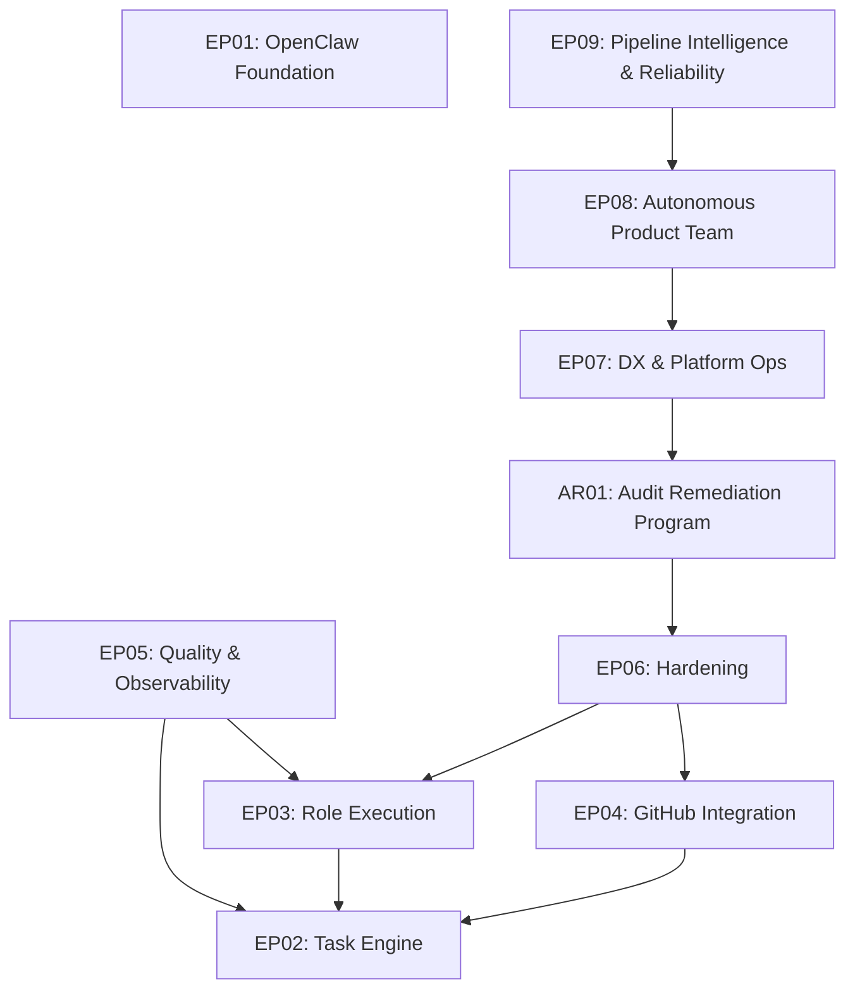

# Roadmap -- OpenClaw Product Team Extensions

> Last updated: 2026-03-05

## Vision

A fully autonomous **product-team** of 8 AI agents (PM, Tech Lead, PO, Designer,
Backend Dev, Frontend Dev, QA, DevOps) operating inside the OpenClaw gateway.
Each agent owns a well-defined slice of the software delivery lifecycle,
communicates through inter-agent messaging, and is governed by tool-policy
allow-lists and a decision engine with escalation policies.

---

## Execution Order

| Phase | Epic | Description                     | Dependencies | Target       | Status  |
|-------|------|---------------------------------|--------------|--------------|---------|
| 1     | EP01 | OpenClaw Foundation             | None         | March 2026   | DONE    |
| 1     | EP02 | Task Engine                     | None         | March 2026   | DONE    |
| 2     | EP03 | Role Execution                  | EP02         | April 2026   | DONE    |
| 3     | EP04 | GitHub Integration              | EP02         | May-Jun 2026 | DONE    |
| 4     | EP05 | Quality & Observability         | EP02, EP03   | July 2026    | DONE    |
| 5     | EP06 | Hardening                       | EP03, EP04   | August 2026  | DONE    |
| 6     | AR01 | Audit Remediation Program       | EP06         | Q1 2026      | DONE |
| 7     | EP07 | DX & Platform Ops               | AR01         | Q2 2026      | DONE    |
| 8     | EP08 | Autonomous Product Team         | EP07         | Q2 2026      | DONE    |
| 9     | EP09 | Pipeline Intelligence & Reliability | EP08     | Q2-Q3 2026   | DONE    |

---

## Phase 1: Foundation (March 2026)

### EP01 -- OpenClaw Foundation

Set up the OpenClaw gateway with authentication, multi-agent routing by role,
and tool policies that restrict each agent to its authorized surface area.

Key deliverables:

- Gateway configuration and startup
- Agent definitions for all six roles (pm, architect, dev, qa, reviewer, infra)
- Tool allow-list policies per role
- Sandbox / environment configuration
- Smoke tests verifying gateway boots and routes correctly

### EP02 -- Task Engine

Build the core TaskRecord lifecycle with SQLite persistence, a strict state
machine, an append-only event log, and lease-based ownership.

Key deliverables:

- Plugin scaffold (`extensions/product-team`)
- TaskRecord domain model (title, status, scope, assignee, metadata)
- SQLite persistence layer with migrations
- State machine with validated transitions
- Event log table for full audit trail
- Lease mechanism for exclusive task ownership
- Tool registration: `task.create`, `task.get`, `task.search`, `task.update`,
  `task.transition`

---

## Phase 2: Role Execution (April 2026)

### EP03 -- Role Execution

Introduce contract-driven workflow execution where each role produces a
validated JSON output conforming to its schema.

Key deliverables:

- JSON schemas per role (po_brief, architecture_plan, dev_result, qa_report,
  review_result)
- Step runner supporting `llm-task` and custom steps
- Quality gate integration (coverage, lint, complexity thresholds)
- FastTrack system for minor-scope tasks that skip architecture review

---

## Phase 3: GitHub Integration (May--June 2026)

### EP04 -- GitHub Integration

Automate branch creation, pull-request management, labelling, and CI feedback
with idempotent request tracking to avoid duplicate operations.

Key deliverables:

- GitHub operations wrapper over `gh` CLI (via `safeSpawn`)
- VCS tool registration (`vcs.branch.create`, `vcs.pr.create`, `vcs.pr.update`,
  `vcs.label.sync`)
- PR-Bot skill for standard PR workflows
- CI webhook feedback (status checks, comments)
- Idempotency keys to prevent duplicate branches/PRs

---

## Phase 4: Quality & Observability (July 2026)

### EP05 -- Quality & Observability

Enforce quality gates as first-class workflow steps and provide visibility into
agent activity through dashboards and structured logging.

Key deliverables:

- Quality tools consolidation (merge `quality-gate` into `product-team`)
- Gate enforcement at state transitions
- Event log dashboard (`workflow.events.query` tool)
- Structured logging (JSON with correlation IDs)

---

## Phase 5: Hardening (August 2026)

### EP06 -- Hardening

Prepare the system for production use with security hardening, cost controls,
concurrency safeguards, and comprehensive documentation.

Key deliverables:

- Tool allow-list audit and tightening
- Cost tracking (LLM tokens + agent wall-clock time per task)
- Per-task budget limits (configurable)
- Secrets management review (DB path validation, no secrets in metadata/logs)
- Concurrency limits (max parallel tasks per agent)
- Runbook for operators
- End-to-end walkthrough documentation

---

## Phase 6: Audit Remediation Program (Q1 2026)

### AR01 -- Post-Audit Remediation Execution

Execute remediation work derived from the 2026-02-25 comprehensive audit in a
controlled queue, preserving strict traceability from finding to task and
walkthrough evidence.

Execution lanes:

- Product contract restoration: command surface and config contract alignment.
- Security hardening and policy enforcement: webhook authenticity, audit gating,
  dependency risk handling.
- Architecture and maintainability convergence: shared quality logic, lifecycle
  reliability, and test/coverage quality.

---

## Phase 7: DX & Platform Ops (Q2 2026)

### EP07 -- DX & Platform Ops

Improve developer experience and operational readiness: automated extension scaffolding,
a reproducible npm publish pipeline, and a full quality-gate feedback loop on pull requests.

Key deliverables:

- Extension scaffolding CLI (`pnpm create:extension <name>`)
- npm publish pipeline for `@openclaw/*` packages with provenance and OIDC
- CI quality gate workflow with PR comment upsert and merge-blocking status checks

---

## Phase 8: Autonomous Product Team (Q2 2026)

### EP08 -- Autonomous Product Team

Deploy a fully autonomous product team of 8 AI agents running inside an
OpenClaw gateway in Docker, with per-agent model routing, Stitch MCP
integration, Telegram channel for human oversight, a web UI for configuration,
and multi-project support.

Key deliverables:

- Docker deployment isolated from existing WSL gateway (port 28789)
- Multi-model provider config (OpenAI, Anthropic, Google AI)
- Telegram channel integration plugin
- Expanded 8-agent roster with per-agent model routing
- Stitch MCP bridge for designer agent
- Multi-project workspace manager
- New role skills (tech-lead, po, designer, backend-dev, frontend-dev, devops)
- Team orchestrator pipeline (roadmap → PR)
- Inter-agent messaging system
- Autonomous decision engine
- End-to-end integration test suite
- Docker Compose production profile
- Configuration web UI extension

---

## Phase 9: Pipeline Intelligence & Reliability (Q2-Q3 2026)

### EP09 -- Pipeline Intelligence & Reliability

Close the gap between EP08's infrastructure (agents, messaging, pipeline tools) and
truly autonomous operation. EP08 deployed the team and gave it tools to track stages
and make decisions. EP09 makes the pipeline self-driving: automatic stage advancement,
enforced timeouts and retry limits, spawn failure recovery, decision outcome learning,
and per-stage metrics that enable continuous improvement.

Key deliverables:

- Automatic pipeline stage advancement driven by the orchestrator loop
- Stage timeout enforcement with escalation (using existing config values)
- Spawn failure recovery: retry queue with dead-letter alerting
- Decision engine fixes: per-agent circuit breaker, maxRetries enforcement, timeout enforcement
- Decision outcome tracking and feedback loop (was the auto-decision later overridden?)
- Per-stage metrics: duration, token cost, retry count, quality gate results
- Pipeline state promotion to indexed DB column (efficient stage-based queries)
- Spawn abstraction layer to decouple from OpenClaw SDK internals
- Per-persona Telegram bot routing for remaining agents (po, qa, devops)

---

---

## Risk Register

| Risk                                    | Mitigation                                   |
|-----------------------------------------|----------------------------------------------|
| OpenClaw API changes before 1.0         | Pin versions, abstract behind plugin API     |
| SQLite concurrency under parallel agents| WAL mode, lease-based locking                |
| Token cost overruns                     | Per-task budget caps (EP06)                  |
| Schema drift between roles              | Shared TypeBox schemas, CI validation        |
| Spawn fragility from SDK internals     | Abstraction layer over WS spawn (EP09)       |
| Silent message loss on spawn failure   | Retry queue with dead-letter alerting (EP09)  |
| Pipeline stalls from unenforced timeouts| Stage timeout enforcement (EP09)             |

---

## Success Criteria

1. All eight agents can execute their role through the gateway.
2. TaskRecords flow through the full lifecycle without manual intervention.
3. Quality gates block bad transitions automatically.
4. GitHub PRs are created and updated by the devops agent.
5. Full audit trail available for every task.
6. Inter-agent messaging delivers across Telegram with per-persona bot identity.
7. Decision engine escalates blockers and resolves conflicts autonomously.

---

## References

### Task Specs
Task-level execution status source of truth:
- `docs/roadmap.md` tracks task status (`PENDING`, `IN_PROGRESS`, `DONE`).
- `docs/backlog/EPxx-*.md` tracks epic-level status only.

- [Task 0001: OpenClaw Foundation](tasks/0001-openclaw-foundation.md) -- DONE
- [Task 0002: Task Engine](tasks/0002-task-engine.md) -- DONE
- [Task 0003: Role Execution](tasks/0003-role-execution.md) -- DONE
- [Task 0004: Coverage Debt Fix](tasks/0004-coverage-debt.md) -- DONE (pre-EP04)
- [Task 0005: GitHub Integration](tasks/0005-github-integration.md) -- DONE (EP04)
- [Task 0006: Quality & Observability](tasks/0006-quality-observability.md) -- DONE (EP05)
- [Task 0007: Hardening](tasks/0007-hardening.md) -- DONE (EP06)
- [Task 0008: PR-Bot Skill Automation](tasks/0008-pr-bot-skill.md) -- DONE (EP04)
- [Task 0009: CI Webhook Feedback](tasks/0009-ci-webhook-feedback.md) -- DONE (EP04)

Audit remediation queue (derived from `audits/2026-02-25-comprehensive-audit-product-security-architecture-development.md`):

- [Task 0010: Restore Root Quality-Gate Command Surface](tasks/0010-restore-root-quality-gate-command-surface.md) -- DONE (Product lane)
- [Task 0011: Fix Quality-Gate Default Command Validation](tasks/0011-fix-quality-gate-default-command-validation.md) -- DONE (Product lane)
- [Task 0012: Align Runbook, Schema, and Runtime Config Contract](tasks/0012-align-runbook-schema-and-runtime-config-contract.md) -- DONE (Product lane)
- [Task 0013: Manage Transitive Vulnerability Remediation Path](tasks/0013-manage-transitive-vulnerability-remediation-path.md) -- DONE (Security lane)
- [Task 0014: Add GitHub Webhook Signature Verification](tasks/0014-add-github-webhook-signature-verification.md) -- DONE (Security lane)
- [Task 0015: Enforce CI High Vulnerability Gating](tasks/0015-enforce-ci-high-vulnerability-gating.md) -- DONE (Security lane)
- [Task 0016: Upgrade Ajv and Verify Schema Security](tasks/0016-upgrade-ajv-and-verify-schema-security.md) -- DONE (Security lane)
- [Task 0017: Consolidate Quality Parser and Policy Contracts](tasks/0017-consolidate-quality-parser-and-policy-contracts.md) -- DONE (Architecture lane)
- [Task 0018: Fix Plugin Lifecycle Listeners and Hotspot Maintainability](tasks/0018-fix-plugin-lifecycle-listeners-and-hotspot-maintainability.md) -- DONE (Architecture and Development lane)
- [Task 0019: Strengthen Quality-Gate Tests and Coverage Policy](tasks/0019-strengthen-quality-gate-tests-and-coverage-policy.md) -- DONE (Development lane)
- [Task 0020: Gate Auto-Tuning from Historical Metrics](tasks/0020-gate-auto-tuning-historical-metrics.md) -- DONE (Open issues intake #154)
- [Task 0021: Threshold Alerts for Coverage Drops or Complexity Rises](tasks/0021-threshold-alerts-notify-on-coverage-drops-or-complexity-rises.md) -- DONE (Open issues intake #155)

### Epic Backlogs
- [EP01 Backlog](backlog/EP01-openclaw-foundation.md)
- [EP02 Backlog](backlog/EP02-task-engine.md)
- [EP03 Backlog](backlog/EP03-role-execution.md)
- [EP04 Backlog](backlog/EP04-github-integration.md)
- [EP05 Backlog](backlog/EP05-quality-observability.md)
- [EP06 Backlog](backlog/EP06-hardening.md)
- [EP07 Backlog](backlog/EP07-dx-platform-ops.md)
- [EP08 Backlog](backlog/EP08-autonomous-product-team.md)
- [EP09 Backlog](backlog/EP09-pipeline-intelligence-reliability.md)
- [Open Issues Intake (Unscheduled)](backlog/open-issues-intake.md)

2026-02-27 audit remediation queue (derived from `audits/2026-02-27-full-audit.md`):

- [Task 0022: Fix Plugin Schema / Runbook Workflow Config Drift](tasks/0022-fix-plugin-schema-workflow-config-drift.md) -- DONE (HIGH, pre-existing fix verified)
- [Task 0023: Enforce Vulnerability Exception Expiry in CI](tasks/0023-enforce-vulnerability-exception-expiry-in-ci.md) -- DONE (HIGH)
- [Task 0024: Track and Remediate Transitive Dependency Vulnerabilities](tasks/0024-track-and-remediate-transitive-dependency-vulnerabilities.md) -- DONE (HIGH)
- [Task 0025: Security Input Validation Hardening](tasks/0025-security-input-validation-hardening.md) -- DONE (MEDIUM)
- [Task 0026: Consolidate exec/spawn and fs Utilities to Shared Contracts](tasks/0026-consolidate-exec-and-fs-utilities-to-shared-contracts.md) -- DONE (MEDIUM)
- [Task 0027: Strengthen Behavioral Test Coverage](tasks/0027-strengthen-behavioral-test-coverage.md) -- DONE (MEDIUM)
- [Task 0028: Fix Coverage Thresholds and CI Enforcement](tasks/0028-fix-coverage-thresholds-and-ci-enforcement.md) -- DONE (MEDIUM)
- [Task 0029: Refactor Large GitHub Module Files](tasks/0029-refactor-large-github-module-files.md) -- DONE (MEDIUM)
- [Task 0030: Consolidate Shared Types and Schemas in Quality Contracts](tasks/0030-consolidate-shared-types-and-schemas-in-quality-contracts.md) -- DONE (LOW)
- [Task 0031: Add Utility Module Tests and Architectural Decision Records](tasks/0031-add-utility-module-tests-and-architectural-decision-records.md) -- DONE (LOW)

2026-03-01 open issues activation (EP07 — DX & Platform Ops):

- [Task 0032: Extension Scaffolding CLI for New OpenClaw Plugins](tasks/0032-extension-scaffolding-cli.md) -- DONE (DX, GitHub #156)
- [Task 0033: npm Publish Pipeline for @openclaw/* Extensions](tasks/0033-npm-publish-pipeline.md) -- DONE (Release engineering, GitHub #157)
- [Task 0034: CI Quality Gate Workflow for Pull Requests](tasks/0034-ci-quality-gate-workflow-for-prs.md) -- DONE (CI/Quality, GitHub #158)

2026-03-01 EP08 — Autonomous Product Team:

### Phase 8A: Infrastructure

- [Task 0035: Docker Deployment Configuration](tasks/0035-docker-deployment-config.md) -- DONE (EP08, 8A)
- [Task 0036: Multi-Model Provider Configuration](tasks/0036-multi-model-provider-config.md) -- DONE (EP08, 8A)
- [Task 0037: Telegram Channel Integration Plugin](tasks/0037-telegram-channel-integration.md) -- DONE (EP08, 8A)
- [Task 0038: Expanded Agent Roster with Per-Agent Model Routing](tasks/0038-agent-roster-model-routing.md) -- DONE (EP08, 8A)

### Phase 8B: Design & Multi-Project

- [Task 0039: Stitch MCP Bridge Plugin](tasks/0039-stitch-mcp-bridge.md) -- DONE (EP08, 8B)
- [Task 0040: Multi-Project Workspace Manager](tasks/0040-multi-project-workspace.md) -- DONE (EP08, 8B)
- [Task 0041: New Skills for Expanded Roles](tasks/0041-new-role-skills.md) -- DONE (EP08, 8B)

### Phase 8C: Autonomous Orchestration

- [Task 0042: Team Orchestrator — Roadmap-to-Task Pipeline](tasks/0042-team-orchestrator-pipeline.md) -- DONE (EP08, 8C)
- [Task 0043: Inter-Agent Messaging System](tasks/0043-inter-agent-messaging.md) -- DONE (EP08, 8C)
- [Task 0044: Autonomous Decision Engine](tasks/0044-autonomous-decision-engine.md) -- DONE (EP08, 8C)

### Phase 8D: Integration Testing & Hardening

- [Task 0045: End-to-End Integration Test Suite](tasks/0045-e2e-integration-tests.md) -- DONE (EP08, 8D)
- [Task 0046: Docker Compose Production Profile](tasks/0046-docker-production-profile.md) -- DONE (EP08, 8D)
- [Task 0047: Configuration Web UI Extension](tasks/0047-config-web-ui.md) -- DONE (EP08, 8D)

2026-03-04 EP09 — Pipeline Intelligence & Reliability:

### Phase 9A: Pipeline Autonomy

- Task 0062: Automatic Pipeline Stage Advancement -- DONE (EP09, 9A)
- Task 0063: Stage Timeout Enforcement -- DONE (EP09, 9A)
- Task 0064: Per-Stage Retry Limit Enforcement -- DONE (EP09, 9A)
- Task 0065: Conditional Design Skip for Non-UI Tasks -- DONE (EP09, 9A)

### Phase 9B: Spawn Reliability

- Task 0066: Spawn Retry Queue with Dead-Letter Alerting -- DONE (EP09, 9B)
- Task 0067: Spawn Abstraction Layer -- DONE (EP09, 9B)

### Phase 9C: Decision Engine Maturity

- [Task 0068: Fix Circuit Breaker Per-Agent Tracking](tasks/0068-fix-circuit-breaker-agent-tracking.md) -- DONE (EP09, 9C)
- Task 0069: Enforce Decision Timeouts -- DONE (EP09, 9C)
- Task 0070: Enforce Blocker maxRetries Policy -- DONE (EP09, 9C)
- Task 0071: Decision Outcome Tracking and Feedback Loop -- DONE (EP09, 9C)

### Phase 9D: Observability & Metrics

- Task 0072: Per-Stage Metrics Collection -- DONE (EP09, 9D)
- Task 0073: Pipeline State Indexing -- DONE (EP09, 9D)
- Task 0074: Structured Stage Transition Events -- DONE (EP09, 9D)

### Phase 9E: Telegram Experience

- Task 0075: Per-Persona Bot Expansion -- DONE (EP09, 9E)
- Task 0076: Telegram Decision Approval Commands -- DONE (EP09, 9E)

### Architecture & Operations
- [ADR-001: Migrate from MCP to OpenClaw](adr/ADR-001-migrate-from-mcp-to-openclaw.md)
- [Transition Guard Evidence](transition-guard-evidence.md)
- [Error Recovery Patterns](error-recovery.md)
- [Extension Integration Patterns](extension-integration.md)
- [Comprehensive Audit (2026-02-24)](audits/2026-02-24-comprehensive-audit.md)
