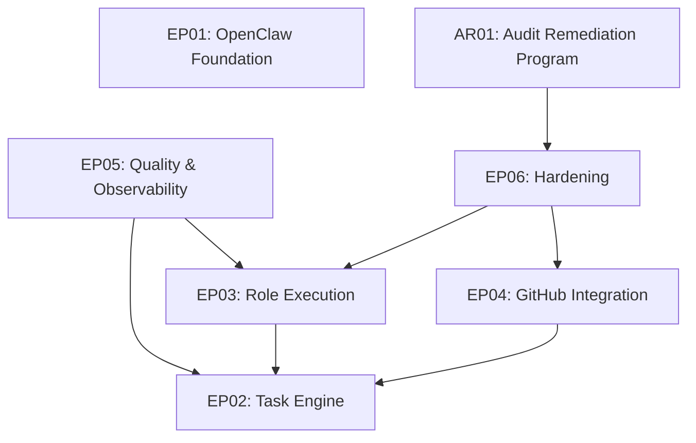

# Roadmap -- OpenClaw Product Team Extensions

> Last updated: 2026-02-25

## Vision

A fully autonomous **product-team** of AI agents (PM, Architect, Dev, QA,
Reviewer, Infra) operating inside the OpenClaw gateway. Each agent owns a
well-defined slice of the software delivery lifecycle, communicates through
structured JSON contracts, and is governed by tool-policy allow-lists.

---

## Execution Order

| Phase | Epic | Description                     | Dependencies | Target       | Status  |
|-------|------|---------------------------------|--------------|--------------|---------|
| 1     | EP01 | OpenClaw Foundation             | None         | March 2026   | DONE    |
| 1     | EP02 | Task Engine                     | None         | March 2026   | DONE    |
| 2     | EP03 | Role Execution                  | EP02         | April 2026   | DONE    |
| 3     | EP04 | GitHub Integration              | EP02         | May-Jun 2026 | DONE    |
| 4     | EP05 | Quality & Observability         | EP02, EP03   | July 2026    | DONE    |
| 5     | EP06 | Hardening                       | EP03, EP04   | August 2026  | DONE    |
| 6     | AR01 | Audit Remediation Program       | EP06         | Q1 2026      | IN_PROGRESS |

---

## Phase 1: Foundation (March 2026)

### EP01 -- OpenClaw Foundation

Set up the OpenClaw gateway with authentication, multi-agent routing by role,
and tool policies that restrict each agent to its authorized surface area.

Key deliverables:

- Gateway configuration and startup
- Agent definitions for all six roles (pm, architect, dev, qa, reviewer, infra)
- Tool allow-list policies per role
- Sandbox / environment configuration
- Smoke tests verifying gateway boots and routes correctly

### EP02 -- Task Engine

Build the core TaskRecord lifecycle with SQLite persistence, a strict state
machine, an append-only event log, and lease-based ownership.

Key deliverables:

- Plugin scaffold (`extensions/product-team`)
- TaskRecord domain model (title, status, scope, assignee, metadata)
- SQLite persistence layer with migrations
- State machine with validated transitions
- Event log table for full audit trail
- Lease mechanism for exclusive task ownership
- Tool registration: `task.create`, `task.get`, `task.search`, `task.update`,
  `task.transition`

---

## Phase 2: Role Execution (April 2026)

### EP03 -- Role Execution

Introduce contract-driven workflow execution where each role produces a
validated JSON output conforming to its schema.

Key deliverables:

- JSON schemas per role (po_brief, architecture_plan, dev_result, qa_report,
  review_result)
- Step runner supporting `llm-task` and custom steps
- Quality gate integration (coverage, lint, complexity thresholds)
- FastTrack system for minor-scope tasks that skip architecture review

---

## Phase 3: GitHub Integration (May--June 2026)

### EP04 -- GitHub Integration

Automate branch creation, pull-request management, labelling, and CI feedback
with idempotent request tracking to avoid duplicate operations.

Key deliverables:

- GitHub operations wrapper over `gh` CLI (via `safeSpawn`)
- VCS tool registration (`vcs.branch.create`, `vcs.pr.create`, `vcs.pr.update`,
  `vcs.label.sync`)
- PR-Bot skill for standard PR workflows
- CI webhook feedback (status checks, comments)
- Idempotency keys to prevent duplicate branches/PRs

---

## Phase 4: Quality & Observability (July 2026)

### EP05 -- Quality & Observability

Enforce quality gates as first-class workflow steps and provide visibility into
agent activity through dashboards and structured logging.

Key deliverables:

- Quality tools consolidation (merge `quality-gate` into `product-team`)
- Gate enforcement at state transitions
- Event log dashboard (`workflow.events.query` tool)
- Structured logging (JSON with correlation IDs)

---

## Phase 5: Hardening (August 2026)

### EP06 -- Hardening

Prepare the system for production use with security hardening, cost controls,
concurrency safeguards, and comprehensive documentation.

Key deliverables:

- Tool allow-list audit and tightening
- Cost tracking (LLM tokens + agent wall-clock time per task)
- Per-task budget limits (configurable)
- Secrets management review (DB path validation, no secrets in metadata/logs)
- Concurrency limits (max parallel tasks per agent)
- Runbook for operators
- End-to-end walkthrough documentation

---

## Phase 6: Audit Remediation Program (Q1 2026)

### AR01 -- Post-Audit Remediation Execution

Execute remediation work derived from the 2026-02-25 comprehensive audit in a
controlled queue, preserving strict traceability from finding to task and
walkthrough evidence.

Execution lanes:

- Product contract restoration: command surface and config contract alignment.
- Security hardening and policy enforcement: webhook authenticity, audit gating,
  dependency risk handling.
- Architecture and maintainability convergence: shared quality logic, lifecycle
  reliability, and test/coverage quality.

---

## Dependency Graph

---

## Risk Register

| Risk                                    | Mitigation                                   |
|-----------------------------------------|----------------------------------------------|
| OpenClaw API changes before 1.0         | Pin versions, abstract behind plugin API     |
| SQLite concurrency under parallel agents| WAL mode, lease-based locking                |
| Token cost overruns                     | Per-task budget caps (EP06)                  |
| Schema drift between roles              | Shared TypeBox schemas, CI validation        |

---

## Success Criteria

1. All six agents can execute their role through the gateway.
2. TaskRecords flow through the full lifecycle without manual intervention.
3. Quality gates block bad transitions automatically.
4. GitHub PRs are created and updated by the infra agent.
5. Full audit trail available for every task.

---

## References

### Task Specs
Task-level execution status source of truth:
- `docs/roadmap.md` tracks task status (`PENDING`, `IN_PROGRESS`, `DONE`).
- `docs/backlog/EPxx-*.md` tracks epic-level status only.

- [Task 0001: OpenClaw Foundation](tasks/0001-openclaw-foundation.md) -- DONE
- [Task 0002: Task Engine](tasks/0002-task-engine.md) -- DONE
- [Task 0003: Role Execution](tasks/0003-role-execution.md) -- DONE
- [Task 0004: Coverage Debt Fix](tasks/0004-coverage-debt.md) -- DONE (pre-EP04)
- [Task 0005: GitHub Integration](tasks/0005-github-integration.md) -- DONE (EP04)
- [Task 0006: Quality & Observability](tasks/0006-quality-observability.md) -- DONE (EP05)
- [Task 0007: Hardening](tasks/0007-hardening.md) -- DONE (EP06)
- [Task 0008: PR-Bot Skill Automation](tasks/0008-pr-bot-skill.md) -- DONE (EP04)
- [Task 0009: CI Webhook Feedback](tasks/0009-ci-webhook-feedback.md) -- DONE (EP04)

Audit remediation queue (derived from `audits/2026-02-25-comprehensive-audit-product-security-architecture-development.md`):

- [Task 0010: Restore Root Quality-Gate Command Surface](tasks/0010-restore-root-quality-gate-command-surface.md) -- DONE (Product lane)
- [Task 0011: Fix Quality-Gate Default Command Validation](tasks/0011-fix-quality-gate-default-command-validation.md) -- DONE (Product lane)
- [Task 0012: Align Runbook, Schema, and Runtime Config Contract](tasks/0012-align-runbook-schema-and-runtime-config-contract.md) -- DONE (Product lane)
- [Task 0013: Manage Transitive Vulnerability Remediation Path](tasks/0013-manage-transitive-vulnerability-remediation-path.md) -- PENDING (Security lane)
- [Task 0014: Add GitHub Webhook Signature Verification](tasks/0014-add-github-webhook-signature-verification.md) -- PENDING (Security lane)
- [Task 0015: Enforce CI High Vulnerability Gating](tasks/0015-enforce-ci-high-vulnerability-gating.md) -- PENDING (Security lane)
- [Task 0016: Upgrade Ajv and Verify Schema Security](tasks/0016-upgrade-ajv-and-verify-schema-security.md) -- PENDING (Security lane)
- [Task 0017: Consolidate Quality Parser and Policy Contracts](tasks/0017-consolidate-quality-parser-and-policy-contracts.md) -- PENDING (Architecture lane)
- [Task 0018: Fix Plugin Lifecycle Listeners and Hotspot Maintainability](tasks/0018-fix-plugin-lifecycle-listeners-and-hotspot-maintainability.md) -- PENDING (Architecture and Development lane)
- [Task 0019: Strengthen Quality-Gate Tests and Coverage Policy](tasks/0019-strengthen-quality-gate-tests-and-coverage-policy.md) -- PENDING (Development lane)

### Epic Backlogs
- [EP01 Backlog](backlog/EP01-openclaw-foundation.md)
- [EP02 Backlog](backlog/EP02-task-engine.md)
- [EP03 Backlog](backlog/EP03-role-execution.md)
- [EP04 Backlog](backlog/EP04-github-integration.md)
- [EP05 Backlog](backlog/EP05-quality-observability.md)
- [EP06 Backlog](backlog/EP06-hardening.md)

### Architecture & Operations
- [ADR-001: Migrate from MCP to OpenClaw](adr/ADR-001-migrate-from-mcp-to-openclaw.md)
- [Transition Guard Evidence](transition-guard-evidence.md)
- [Error Recovery Patterns](error-recovery.md)
- [Extension Integration Patterns](extension-integration.md)
- [Comprehensive Audit (2026-02-24)](audits/2026-02-24-comprehensive-audit.md)
