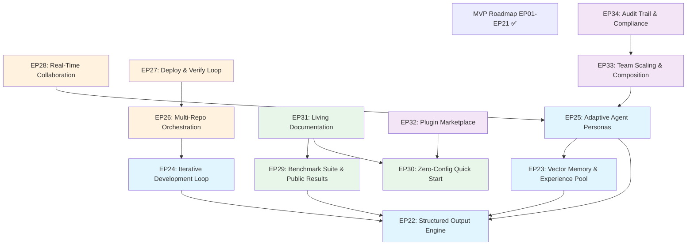

# Roadmap V1 -- From Functional MVP to High-Reputation Open Source

> Last updated: 2026-03-30

## Vision

Roadmap MVP (EP01-EP21) delivered a **functional autonomous product team**: 8 agents,
10-stage pipeline, budget intelligence, learning loops, observability, and a Telegram
control plane. The system works. But "works" is table stakes.

**Roadmap V1 transforms vibe-flow from a working demo into an open-source project that
earns high reputation by solving real problems better than alternatives.**

The strategy is informed by a deep analysis of MetaGPT (66K stars, ICLR oral papers,
7+ publications) — identifying gaps where they excel and we don't, and strengths where
we lead and they can't follow.

### What We Learned from MetaGPT

MetaGPT's popularity comes from three things:
1. **Zero-config onboarding** -- `pip install metagpt && metagpt "create a game"` works
2. **Structured output contracts** -- ActionNode trees make every agent output typed and validated
3. **Experience accumulation** -- Vector-backed memory means the 100th run is better than the 1st

MetaGPT's weaknesses are our opportunities:
- **No budget management** -- burns tokens blindly, no cost controls
- **No quality gates** -- outputs are unchecked, errors propagate downstream
- **No observability** -- black box, no metrics, no dashboards
- **No human oversight** -- CLI only, no Telegram/mobile control plane
- **Single-pass execution** -- no iteration, no feedback loops in pipeline
- **Research-grade infrastructure** -- no Docker, no CI, known RCE vulnerabilities
- **No model routing** -- single model, no fallbacks, no cost optimization

### Strategic Thesis

> **MetaGPT is easy to try but fragile in production.**
> **vibe-flow is production-grade but hard to try.**
> **V1 fixes both: easy onboarding AND production quality.**

### V1 Strategic Axes

1. **Intelligence** -- Structured outputs, vector memory, iterative development, adaptive agents
2. **Real-World Readiness** -- Multi-repo, deploy-to-verify, real-time collaboration
3. **Community & Reputation** -- Benchmarks, zero-config start, living documentation
4. **Enterprise & Scale** -- Plugin ecosystem, team composition, compliance

---

## Execution Order

| Phase | Epic | Description                              | Dependencies    | Priority |
|-------|------|------------------------------------------|-----------------|----------|
| V1-1  | EP30 | Zero-Config Quick Start                  | None            | CRITICAL |
| V1-1  | EP22 | Structured Output Engine                 | None            | CRITICAL |
| V1-2  | EP23 | Vector Memory & Experience Pool          | EP22            | CRITICAL |
| V1-2  | EP24 | Iterative Development Loop               | EP22            | HIGH     |
| V1-2  | EP29 | Benchmark Suite & Public Results         | EP22            | HIGH     |
| V1-3  | EP25 | Adaptive Agent Personas                  | EP22, EP23      | HIGH     |
| V1-3  | EP31 | Living Documentation & Tutorials         | EP30, EP29      | HIGH     |
| V1-4  | EP32 | Plugin Marketplace & Ecosystem           | EP30            | MEDIUM   |
| V1-4  | EP26 | Multi-Repository Orchestration           | EP24            | MEDIUM   |
| V1-5  | EP28 | Real-Time Collaboration Protocol         | EP25            | MEDIUM   |
| V1-5  | EP27 | Deployment & Verification Loop           | EP26            | MEDIUM   |
| V1-6  | EP33 | Team Scaling & Role Composition          | EP25            | MEDIUM   |
| V1-6  | EP34 | Audit Trail & Compliance                 | EP33            | MEDIUM   |

---

## Axis 1: Intelligence Leap

> Make agents smarter, not just faster.

### EP22 -- Structured Output Engine

**Problem:** Agents produce ad-hoc JSON outputs validated by loose schemas. Schema
violations cause downstream failures that are hard to diagnose. MetaGPT's ActionNode
system proves that typed, nested output trees dramatically improve reliability.

**Solution:** Build a structured output engine where every agent role at every pipeline
stage has a registered, versioned output schema. Outputs are automatically validated
with retry-on-failure. Nested composition allows subtask trees.

Key deliverables:

- Output schema registry (TypeBox/JSON Schema per role per stage)
- Automatic validation with configurable retry on schema violation
- Nested output composition for subtask decomposition
- Output versioning and backwards compatibility layer
- Migration of all 8 agent roles to structured output contracts
- Schema diff tooling (detect breaking changes between versions)

#### Tasks

- Task 0150: Output Schema Registry and Validation Engine -- PENDING (EP22, V1-1A)
- Task 0151: Retry-on-Violation with Structured Error Feedback -- PENDING (EP22, V1-1A)
- Task 0152: Nested Output Composition for Subtask Trees -- PENDING (EP22, V1-1B)
- Task 0153: Output Versioning and Compatibility Layer -- PENDING (EP22, V1-1B)
- Task 0154: Migrate All 8 Roles to Structured Output Contracts -- PENDING (EP22, V1-1C)

---

### EP23 -- Vector Memory & Experience Pool

**Problem:** Agents forget everything between pipeline runs. The 100th project gets the
same quality as the 1st. MetaGPT's experience pool with Chroma/FAISS + BM25 hybrid
retrieval means agents learn from past successes. This is the #1 capability gap.

**Solution:** Integrate a local-first vector store (SQLite-vec or LanceDB) with an
adapter interface for cloud stores. Index every successful pipeline stage output.
Before generating new outputs, retrieve similar past successes as few-shot examples.

Key deliverables:

- Local vector store integration (SQLite-vec or LanceDB, zero external deps)
- Adapter interface for cloud vector stores (Chroma, Pinecone, Weaviate)
- Experience indexing: successful stage outputs automatically vectorized and stored
- Few-shot context injection: retrieve top-k similar past outputs before generation
- Cross-project knowledge transfer (patterns from project A help project B)
- Memory pruning, relevance scoring, and configurable retention policies
- Memory dashboard in observability endpoints

#### Tasks

- Task 0155: Local Vector Store Integration (SQLite-vec/LanceDB) -- PENDING (EP23, V1-2A)
- Task 0156: Experience Indexing Pipeline -- PENDING (EP23, V1-2A)
- Task 0157: Few-Shot Context Injection Engine -- PENDING (EP23, V1-2B)
- Task 0158: Cross-Project Knowledge Transfer -- PENDING (EP23, V1-2B)
- Task 0159: Memory Pruning and Retention Policies -- PENDING (EP23, V1-2C)
- Task 0160: Vector Store Adapter Interface (Cloud Providers) -- PENDING (EP23, V1-2C)

---

### EP24 -- Iterative Development Loop

**Problem:** The pipeline is single-pass. When QA finds bugs, there is no mechanism to
loop back to IMPLEMENTATION with findings. Real software development is iterative.
MetaGPT has REFINED_NODES for iterative code improvement.

**Solution:** Add a stage re-entry protocol. QA can send findings back to
IMPLEMENTATION with specific bug reports. The developer agent sees a diff of what
failed, not a full regeneration. Quality convergence is tracked to prevent infinite
loops.

Key deliverables:

- Stage re-entry protocol (QA → IMPLEMENTATION with structured findings)
- Diff-based iteration (agent sees what to fix, not full regeneration from scratch)
- Max iteration limits with escalation to human when convergence fails
- Quality convergence tracking (did iteration N improve metrics vs iteration N-1?)
- Regression guards (iteration must not degrade previously passing quality metrics)
- Iteration history in pipeline timeline (visible via observability endpoints)

#### Tasks

- Task 0161: Stage Re-Entry Protocol -- PENDING (EP24, V1-2A)
- Task 0162: Diff-Based Iteration Engine -- PENDING (EP24, V1-2A)
- Task 0163: Quality Convergence Tracker -- PENDING (EP24, V1-2B)
- Task 0164: Regression Guards for Iterative Stages -- PENDING (EP24, V1-2B)
- Task 0165: Iteration Limits and Human Escalation -- PENDING (EP24, V1-2C)

---

### EP25 -- Adaptive Agent Personas

**Problem:** Agent definitions are fixed per pipeline stage. A backend dev always uses
the same tools, same reasoning depth, same approach. MetaGPT's RoleZero introduces
a universal agent base with dynamic tool maps, self-correction loops, and quick-think
routing for simple tasks.

**Solution:** Build a universal agent base class with a react loop. Agents dynamically
select tools based on task context, self-evaluate outputs against criteria before
submitting, and route simple tasks through cheaper/faster paths.

Key deliverables:

- Universal agent base class with configurable react loop (1-N iterations)
- Dynamic tool map per task context (e.g., backend dev gains DB tools for data tasks)
- Self-correction loop: agent evaluates own output → fixes issues → resubmits
- Quick-think routing: simple tasks skip heavy reasoning, saving tokens
- Agent capability discovery (runtime query: "what can this agent do right now?")
- Persona composition (combine skills from multiple roles for hybrid tasks)

#### Tasks

- Task 0166: Universal Agent Base with React Loop -- PENDING (EP25, V1-3A)
- Task 0167: Dynamic Tool Map per Task Context -- PENDING (EP25, V1-3A)
- Task 0168: Self-Correction Loop with Criteria Evaluation -- PENDING (EP25, V1-3B)
- Task 0169: Quick-Think Routing for Simple Tasks -- PENDING (EP25, V1-3B)
- Task 0170: Agent Capability Discovery and Persona Composition -- PENDING (EP25, V1-3C)

---

## Axis 2: Real-World Readiness

> Solve problems no other multi-agent framework touches.

### EP26 -- Multi-Repository Orchestration

**Problem:** Real products span multiple repositories. A feature might require changes
in an API repo, a frontend repo, and a shared library repo. No multi-agent framework
handles this. Being first is a genuine differentiator.

**Solution:** Extend the pipeline to support cross-repo task decomposition with
coordinated PRs, shared context across repo boundaries, and dependency-aware test
orchestration.

Key deliverables:

- Cross-repo task decomposition (one idea → subtasks across repos)
- Coordinated PRs (atomic multi-repo changes with cross-references)
- Shared context across repo boundaries (decisions in repo A visible to repo B agents)
- Dependency-aware build/test orchestration (test in order of dependency)
- Monorepo AND polyrepo support with unified pipeline view

#### Tasks

- Task 0171: Cross-Repo Task Decomposition Engine -- PENDING (EP26, V1-4A)
- Task 0172: Coordinated Multi-Repo PR Creation -- PENDING (EP26, V1-4A)
- Task 0173: Cross-Repo Shared Context Protocol -- PENDING (EP26, V1-4B)
- Task 0174: Dependency-Aware Build/Test Orchestration -- PENDING (EP26, V1-4B)
- Task 0175: Monorepo/Polyrepo Unified Pipeline View -- PENDING (EP26, V1-4C)

---

### EP27 -- Deployment & Verification Loop

**Problem:** The pipeline ends at PR creation. Real delivery goes through merge →
deploy → verify → monitor. Being truly end-to-end from IDEA to production is a
powerful selling point.

**Solution:** Extend the pipeline past SHIPPING to include deployment triggers, smoke
test verification, and automatic rollback on failure. Integrate with environment
management and observability.

Key deliverables:

- Post-merge deployment trigger (configurable: auto or manual approval)
- Smoke test verification after deploy (agent runs health checks)
- Automatic rollback on verification failure
- Environment management (staging → production promotion)
- Deploy metrics integration with existing observability endpoints
- Deploy status in Telegram control plane

#### Tasks

- Task 0176: Post-Merge Deployment Trigger -- PENDING (EP27, V1-5A)
- Task 0177: Smoke Test Verification Agent -- PENDING (EP27, V1-5A)
- Task 0178: Automatic Rollback on Verification Failure -- PENDING (EP27, V1-5B)
- Task 0179: Environment Management (Staging/Production) -- PENDING (EP27, V1-5B)
- Task 0180: Deploy Metrics and Telegram Integration -- PENDING (EP27, V1-5C)

---

### EP28 -- Real-Time Collaboration Protocol

**Problem:** Inter-agent messaging is fire-and-forget. The tech lead can't ask the
developer a clarifying question mid-review. Two agents can't work on the same problem
simultaneously. Real collaboration needs negotiation, shared context, and
conflict resolution.

**Solution:** Build synchronous agent-to-agent negotiation, shared working memory per
pipeline, and conflict resolution protocols. Enable collaborative code review where
the reviewer posts comments and the developer responds in a loop.

Key deliverables:

- Synchronous agent-to-agent negotiation (request → response within timeout)
- Shared working memory per pipeline (all agents see accumulated context)
- Conflict resolution protocol (two agents disagree → structured debate → resolution)
- Collaborative code review (reviewer comments → dev fixes → re-review cycle)
- Pair programming mode (two agents collaborate on same file simultaneously)
- Collaboration metrics in observability (negotiation success rate, resolution time)

#### Tasks

- Task 0181: Synchronous Agent Negotiation Protocol -- PENDING (EP28, V1-5A)
- Task 0182: Shared Working Memory per Pipeline -- PENDING (EP28, V1-5A)
- Task 0183: Conflict Resolution Engine -- PENDING (EP28, V1-5B)
- Task 0184: Collaborative Code Review Loop -- PENDING (EP28, V1-5B)
- Task 0185: Pair Programming Mode -- PENDING (EP28, V1-5C)

---

## Axis 3: Community & Reputation

> Prove it works. Make it trivial to try.

### EP29 -- Benchmark Suite & Public Results

**Problem:** MetaGPT has 7 papers and SWE-bench scores. We have one case study.
"Trust me, it works" doesn't earn stars. The open-source community demands measurable
proof of capability.

**Solution:** Build a benchmark suite that runs vibe-flow against standard benchmarks
(SWE-bench Lite, HumanEval) and custom multi-agent metrics (pipeline efficiency, cost
per task, quality scores). Publish results publicly and auto-update from CI.

Key deliverables:

- SWE-bench Lite integration (standard code repair benchmark)
- HumanEval / MBPP code generation benchmarks
- Custom multi-agent benchmark (pipeline efficiency, token cost, quality gate scores)
- Public results page on GitHub Pages (auto-updated from CI runs)
- Comparison matrix vs MetaGPT, CrewAI, AutoGen, ChatDev
- Reproducible benchmark scripts (anyone can verify results)

#### Tasks

- Task 0186: SWE-bench Lite Integration -- PENDING (EP29, V1-2A)
- Task 0187: Custom Multi-Agent Pipeline Benchmark -- PENDING (EP29, V1-2A)
- Task 0188: Public Results Page with Auto-Update -- PENDING (EP29, V1-2B)
- Task 0189: Comparison Matrix vs Alternatives -- PENDING (EP29, V1-2B)
- Task 0190: HumanEval/MBPP Code Generation Benchmark -- PENDING (EP29, V1-2C)

---

### EP30 -- Zero-Config Quick Start

**Problem:** vibe-flow requires Docker, OpenClaw gateway, 8 agent configurations,
model API keys, and a project workspace to try. MetaGPT requires `pip install metagpt`.
The barrier to entry is too high for casual evaluation.

**Solution:** Build a `npx create-vibe-flow` bootstrap that sets up everything with
sensible defaults. Offer a 2-agent minimal mode (dev + qa) that runs on free-tier
models. Include a playground mode with no Git and no Docker — just local file output.

Key deliverables:

- `npx create-vibe-flow` one-command bootstrap CLI
- Sensible defaults: 2-agent minimal mode (dev + qa) for quick evaluation
- Free-tier-only mode (runs on copilot-proxy without paid API keys)
- Interactive setup wizard (choose team size, model provider, project type)
- "Hello World" demo that produces a working output in < 5 minutes
- Playground mode (no Git, no Docker, local file output only)
- Upgrade path from minimal → full team (add agents incrementally)

#### Tasks

- Task 0191: create-vibe-flow CLI Bootstrap -- PENDING (EP30, V1-1A)
- Task 0192: 2-Agent Minimal Mode (Dev + QA) -- PENDING (EP30, V1-1A)
- Task 0193: Free-Tier-Only Mode with Copilot-Proxy -- PENDING (EP30, V1-1B)
- Task 0194: Interactive Setup Wizard -- PENDING (EP30, V1-1B)
- Task 0195: Playground Mode (No Git, No Docker) -- PENDING (EP30, V1-1C)

---

### EP31 -- Living Documentation & Tutorials

**Problem:** MetaGPT's 100-page tutorial system is a major driver of adoption. Our docs
are accurate but sparse. Good documentation is the difference between 66K stars and 60.

**Solution:** Create an interactive tutorial series, terminal recordings, architecture
deep-dives, and a community cookbook. Make documentation a first-class deliverable,
not an afterthought.

Key deliverables:

- Interactive tutorial series ("Build a TODO app with vibe-flow", step by step)
- Terminal recordings with asciinema (watch agents work in real time)
- Architecture deep-dive articles (how each subsystem works, with diagrams)
- "How it works" interactive web diagrams (beyond static Mermaid)
- Community cookbook (recipes: "add a security agent", "integrate with Jira", etc.)
- Weekly changelog / devlog (build in public)

#### Tasks

- Task 0196: Interactive Tutorial Series (TODO App) -- PENDING (EP31, V1-3A)
- Task 0197: Terminal Recordings with Asciinema -- PENDING (EP31, V1-3A)
- Task 0198: Architecture Deep-Dive Articles -- PENDING (EP31, V1-3B)
- Task 0199: Community Cookbook -- PENDING (EP31, V1-3B)
- Task 0200: Devlog Infrastructure and First Entries -- PENDING (EP31, V1-3C)

---

## Axis 4: Enterprise & Scale

> Make it production-worthy for real teams.

### EP32 -- Plugin Marketplace & Ecosystem

**Problem:** Extensibility is our architectural advantage (OpenClaw extensions). But
there's no way to discover, share, or install community plugins. Network effects
require a frictionless ecosystem.

**Solution:** Build a plugin registry (JSON index, no central server), a CLI installer,
a discovery page on GitHub Pages, and quality scoring for plugins.

Key deliverables:

- Plugin registry (decentralized JSON index, no central server needed)
- `vibe-flow plugin install <name>` CLI command
- Plugin discovery page on GitHub Pages with search and filtering
- Plugin quality scoring (tests present, docs quality, compatibility version)
- Template gallery (starter projects by type: web app, API, CLI, library)
- Plugin authoring guide with examples

#### Tasks

- Task 0201: Plugin Registry Format and CLI Install -- PENDING (EP32, V1-4A)
- Task 0202: Plugin Discovery Page on GitHub Pages -- PENDING (EP32, V1-4A)
- Task 0203: Plugin Quality Scoring Engine -- PENDING (EP32, V1-4B)
- Task 0204: Template Gallery by Project Type -- PENDING (EP32, V1-4B)
- Task 0205: Plugin Authoring Guide -- PENDING (EP32, V1-4C)

---

### EP33 -- Team Scaling & Role Composition

**Problem:** The 8-agent team is hardcoded. A security audit project needs a security
agent. A data pipeline project needs a data engineer. A mobile app needs iOS/Android
specialists. Teams should be composable.

**Solution:** Enable dynamic role registration, role composition templates, and scaling
policies. Make it possible to add/remove agents at runtime and compose custom teams
for specific project types.

Key deliverables:

- Dynamic role registration (add/remove agents at runtime via config or API)
- Role composition templates (security team, data team, mobile team presets)
- Custom skill authoring guide (build a skill in 15 minutes)
- Role capability negotiation (team auto-discovers its collective capabilities)
- Scaling policies (add agents under load, remove when idle, budget-aware)
- Team composition validation (ensure required roles are present for pipeline)

#### Tasks

- Task 0206: Dynamic Role Registration Engine -- PENDING (EP33, V1-6A)
- Task 0207: Role Composition Templates -- PENDING (EP33, V1-6A)
- Task 0208: Custom Skill Authoring Guide -- PENDING (EP33, V1-6B)
- Task 0209: Role Capability Negotiation Protocol -- PENDING (EP33, V1-6B)
- Task 0210: Team Scaling Policies -- PENDING (EP33, V1-6C)

---

### EP34 -- Audit Trail & Compliance

**Problem:** Enterprise adoption requires immutable audit trails, decision
reproducibility, and standard compliance exports. We have event logs but they're not
compliance-grade.

**Solution:** Add cryptographic chaining to the audit log, decision replay capability,
cost attribution reports, RBAC for human operators, and export to standard formats.

Key deliverables:

- Immutable audit log with cryptographic hash chaining (tamper-evident)
- Decision replay (reproduce any past decision from logs + context)
- Cost attribution reports (per-project, per-agent, per-model breakdowns)
- RBAC for human operators (admin, viewer, approver roles)
- Export to standard formats (SARIF for security, JUnit for tests, CSV for costs)
- Compliance dashboard in Telegram control plane

#### Tasks

- Task 0211: Cryptographic Audit Log Chaining -- PENDING (EP34, V1-6A)
- Task 0212: Decision Replay Engine -- PENDING (EP34, V1-6A)
- Task 0213: Cost Attribution Reports -- PENDING (EP34, V1-6B)
- Task 0214: RBAC for Human Operators -- PENDING (EP34, V1-6B)
- Task 0215: Standard Format Export (SARIF, JUnit, CSV) -- PENDING (EP34, V1-6C)

---

## Dependency Graph

---

## Risk Register

| Risk | Impact | Probability | Mitigation |
|------|--------|-------------|------------|
| Vector store adds complexity without clear quality improvement | HIGH | MEDIUM | EP29 benchmarks measure before/after; kill EP23 if no measurable gain |
| Zero-config mode hides too much, users can't debug | MEDIUM | MEDIUM | Progressive disclosure: minimal start, `--verbose` flag, upgrade path |
| SWE-bench scores are worse than MetaGPT | HIGH | MEDIUM | Focus on cost-efficiency and quality metrics where we win, not raw solve rate |
| Multi-repo orchestration is too complex for V1 | HIGH | HIGH | Deliver monorepo-first, polyrepo as optional extension |
| Plugin ecosystem gets no contributions | MEDIUM | HIGH | Seed with 5+ first-party plugins, make authoring trivially easy |
| Iterative loops cause infinite retry costs | MEDIUM | LOW | Hard iteration limits (max 3), budget-aware loop termination |
| Pair programming mode is too token-expensive | MEDIUM | MEDIUM | Make it opt-in, only for complex tasks, quick-think routing skips it |
| Structured output migration breaks existing workflows | HIGH | LOW | Backwards-compatibility layer, phased rollout by role |
| Academic benchmarks don't translate to real-world reputation | MEDIUM | MEDIUM | Balance benchmarks with real case studies and user testimonials |
| Team scaling adds operational complexity | MEDIUM | MEDIUM | Default to fixed teams, scaling as advanced feature |

---

## Success Criteria

### V1-1: Quick Start + Structured Outputs
1. New user → first output in < 5 minutes with `npx create-vibe-flow`
2. All 8 agent roles produce schema-validated outputs with zero ad-hoc JSON
3. Schema violations trigger automatic retry (>= 80% auto-recovery rate)

### V1-2: Memory + Iteration + Benchmarks
4. 10th pipeline run produces measurably higher quality than 1st (quality gate scores)
5. QA → IMPLEMENTATION iteration resolves >= 60% of findings without human intervention
6. Cross-project knowledge transfer demonstrably improves output on new projects
7. Published SWE-bench Lite results with cost-efficiency comparison

### V1-3: Adaptive Agents + Documentation
8. Quick-think routing saves >= 30% tokens on simple tasks
9. Self-correction loop catches >= 50% of issues before QA stage
10. Tutorial series enables a new user to build a complete project in < 30 minutes
11. Terminal recordings generate measurable community engagement

### V1-4: Ecosystem + Multi-Repo
12. Plugin CLI installs and activates community plugins in < 1 minute
13. >= 5 community-contributed plugins within 6 months
14. Cross-repo feature delivered as coordinated PRs across 2+ repositories

### V1-5: Collaboration + Deploy
15. Collaborative code review reduces post-merge defects by >= 40%
16. End-to-end: IDEA → deployed and verified in production
17. Automatic rollback triggers on verification failure

### V1-6: Team Scaling + Compliance
18. Custom team composition (e.g., 4-agent security team) works out of the box
19. Audit log is cryptographically tamper-evident
20. Any past decision can be replayed from logs within 10 seconds
21. Cost attribution reports match actual LLM provider invoices

### Overall V1
22. **500+ GitHub stars** within 6 months of V1-1 launch
23. **60%+ token cost reduction** vs MetaGPT on equivalent tasks
24. **>= 3 external blog posts** referencing vibe-flow

---

## References

### MVP Roadmap
- [Roadmap MVP (EP01-EP21)](roadmap_mvp.md) -- completed foundation

### V1 Epic Backlogs
- [EP22 Backlog](backlog/EP22-structured-output-engine.md)
- [EP23 Backlog](backlog/EP23-vector-memory-experience-pool.md) -- TODO
- [EP24 Backlog](backlog/EP24-iterative-development-loop.md) -- TODO
- [EP25 Backlog](backlog/EP25-adaptive-agent-personas.md) -- TODO
- [EP26 Backlog](backlog/EP26-multi-repo-orchestration.md) -- TODO
- [EP27 Backlog](backlog/EP27-deployment-verification-loop.md) -- TODO
- [EP28 Backlog](backlog/EP28-real-time-collaboration.md) -- TODO
- [EP29 Backlog](backlog/EP29-benchmark-suite.md) -- TODO
- [EP30 Backlog](backlog/EP30-zero-config-quick-start.md)
- [EP31 Backlog](backlog/EP31-living-documentation.md) -- TODO
- [EP32 Backlog](backlog/EP32-plugin-marketplace.md) -- TODO
- [EP33 Backlog](backlog/EP33-team-scaling-composition.md) -- TODO
- [EP34 Backlog](backlog/EP34-audit-trail-compliance.md) -- TODO

### Task Specs (V1)

#### EP22 -- Structured Output Engine
- Task 0150: Output Schema Registry and Validation Engine -- PENDING
- Task 0151: Retry-on-Violation with Structured Error Feedback -- PENDING
- Task 0152: Nested Output Composition for Subtask Trees -- PENDING
- Task 0153: Output Versioning and Compatibility Layer -- PENDING
- Task 0154: Migrate All 8 Roles to Structured Output Contracts -- PENDING

#### EP23 -- Vector Memory & Experience Pool
- Task 0155: Local Vector Store Integration -- PENDING
- Task 0156: Experience Indexing Pipeline -- PENDING
- Task 0157: Few-Shot Context Injection Engine -- PENDING
- Task 0158: Cross-Project Knowledge Transfer -- PENDING
- Task 0159: Memory Pruning and Retention Policies -- PENDING
- Task 0160: Vector Store Adapter Interface -- PENDING

#### EP24 -- Iterative Development Loop
- Task 0161: Stage Re-Entry Protocol -- PENDING
- Task 0162: Diff-Based Iteration Engine -- PENDING
- Task 0163: Quality Convergence Tracker -- PENDING
- Task 0164: Regression Guards for Iterative Stages -- PENDING
- Task 0165: Iteration Limits and Human Escalation -- PENDING

#### EP25 -- Adaptive Agent Personas
- Task 0166: Universal Agent Base with React Loop -- PENDING
- Task 0167: Dynamic Tool Map per Task Context -- PENDING
- Task 0168: Self-Correction Loop with Criteria Evaluation -- PENDING
- Task 0169: Quick-Think Routing for Simple Tasks -- PENDING
- Task 0170: Agent Capability Discovery and Persona Composition -- PENDING

#### EP26 -- Multi-Repository Orchestration
- Task 0171: Cross-Repo Task Decomposition Engine -- PENDING
- Task 0172: Coordinated Multi-Repo PR Creation -- PENDING
- Task 0173: Cross-Repo Shared Context Protocol -- PENDING
- Task 0174: Dependency-Aware Build/Test Orchestration -- PENDING
- Task 0175: Monorepo/Polyrepo Unified Pipeline View -- PENDING

#### EP27 -- Deployment & Verification Loop
- Task 0176: Post-Merge Deployment Trigger -- PENDING
- Task 0177: Smoke Test Verification Agent -- PENDING
- Task 0178: Automatic Rollback on Verification Failure -- PENDING
- Task 0179: Environment Management -- PENDING
- Task 0180: Deploy Metrics and Telegram Integration -- PENDING

#### EP28 -- Real-Time Collaboration Protocol
- Task 0181: Synchronous Agent Negotiation Protocol -- PENDING
- Task 0182: Shared Working Memory per Pipeline -- PENDING
- Task 0183: Conflict Resolution Engine -- PENDING
- Task 0184: Collaborative Code Review Loop -- PENDING
- Task 0185: Pair Programming Mode -- PENDING

#### EP29 -- Benchmark Suite & Public Results
- Task 0186: SWE-bench Lite Integration -- PENDING
- Task 0187: Custom Multi-Agent Pipeline Benchmark -- PENDING
- Task 0188: Public Results Page with Auto-Update -- PENDING
- Task 0189: Comparison Matrix vs Alternatives -- PENDING
- Task 0190: HumanEval/MBPP Code Generation Benchmark -- PENDING

#### EP30 -- Zero-Config Quick Start
- Task 0191: create-vibe-flow CLI Bootstrap -- PENDING
- Task 0192: 2-Agent Minimal Mode (Dev + QA) -- PENDING
- Task 0193: Free-Tier-Only Mode with Copilot-Proxy -- PENDING
- Task 0194: Interactive Setup Wizard -- PENDING
- Task 0195: Playground Mode (No Git, No Docker) -- PENDING

#### EP31 -- Living Documentation & Tutorials
- Task 0196: Interactive Tutorial Series -- PENDING
- Task 0197: Terminal Recordings with Asciinema -- PENDING
- Task 0198: Architecture Deep-Dive Articles -- PENDING
- Task 0199: Community Cookbook -- PENDING
- Task 0200: Devlog Infrastructure and First Entries -- PENDING

#### EP32 -- Plugin Marketplace & Ecosystem
- Task 0201: Plugin Registry Format and CLI Install -- PENDING
- Task 0202: Plugin Discovery Page on GitHub Pages -- PENDING
- Task 0203: Plugin Quality Scoring Engine -- PENDING
- Task 0204: Template Gallery by Project Type -- PENDING
- Task 0205: Plugin Authoring Guide -- PENDING

#### EP33 -- Team Scaling & Role Composition
- Task 0206: Dynamic Role Registration Engine -- PENDING
- Task 0207: Role Composition Templates -- PENDING
- Task 0208: Custom Skill Authoring Guide -- PENDING
- Task 0209: Role Capability Negotiation Protocol -- PENDING
- Task 0210: Team Scaling Policies -- PENDING

#### EP34 -- Audit Trail & Compliance
- Task 0211: Cryptographic Audit Log Chaining -- PENDING
- Task 0212: Decision Replay Engine -- PENDING
- Task 0213: Cost Attribution Reports -- PENDING
- Task 0214: RBAC for Human Operators -- PENDING
- Task 0215: Standard Format Export -- PENDING
