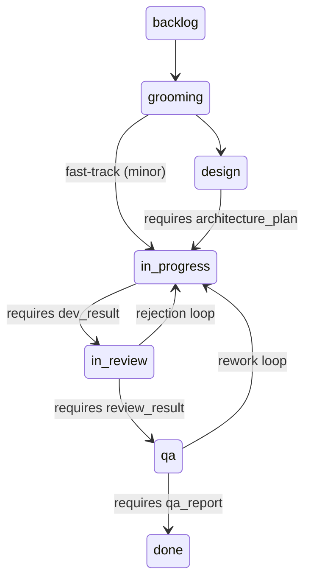

# Transition Guard Evidence Reference

This document defines the metadata evidence required for guarded task
transitions in `extensions/product-team/src/orchestrator/transition-guards.ts`.

## Overview

Transition guards evaluate `task.metadata` before allowing specific state
changes. If required evidence is missing or invalid, transitions fail with
`TransitionGuardError`.

Only guarded transitions are validated. Unguarded transitions always pass.



## Guard Matrix

| Transition | Guard | Required metadata | Typical source |
|---|---|---|---|
| `design -> in_progress` | Architecture review | `architecture_plan` | `workflow.step.run` (`schemaKey: architecture_plan`) |
| `in_progress -> in_review` | Dev quality check | `dev_result` | `quality.coverage`, `quality.lint`, plus `workflow.step.run` (`schemaKey: dev_result`) |
| `in_review -> qa` | Review cleanliness | `review_result` | `workflow.step.run` (`schemaKey: review_result`) |
| `qa -> done` | QA pass | `qa_report` | `quality.tests` or `workflow.step.run` (`schemaKey: qa_report`) |

## Detailed Evidence Requirements

### 1. `design -> in_progress`

Required key: `task.metadata.architecture_plan`

Validation:
- `architecture_plan` must be an object.
- `architecture_plan.adr_id` must be a non-empty string.
- `architecture_plan.contracts` must be a non-empty array with at least one non-empty string.

### 2. `in_progress -> in_review`

Required key: `task.metadata.dev_result`

Validation:
- `dev_result` must be an object.
- `dev_result.metrics.coverage` must be a number and meet scope threshold:
  - `major`: >= 80 (default)
  - `minor`: >= 70 (default)
  - `patch`: >= 70 (default)
- `dev_result.metrics.lint_clean` must be `true`.
- `dev_result.red_green_refactor_log` must have at least 2 entries.

Current metadata population behavior:
- `quality.coverage` writes `dev_result.metrics.coverage`.
- `quality.lint` writes `dev_result.metrics.lint_clean`.
- `workflow.step.run` (or `task.update`) is still needed to provide
  `red_green_refactor_log` when missing.

### 3. `in_review -> qa`

Required key: `task.metadata.review_result`

Validation:
- `review_result` must be an object.
- `review_result.violations` must be an array.
- No violation may have severity `high` or `critical`.
- Unknown/malformed severities are treated as high severity.
- `orchestratorState.roundsReview` must be `< maxReviewRounds` (default `3`).

### 4. `qa -> done`

Required key: `task.metadata.qa_report`

Validation:
- `qa_report` must be an object.
- `qa_report.failed` must be a number equal to `0`.

Current metadata population behavior:
- `quality.tests` writes `task.metadata.qa_report`.

## Unguarded Transitions

| Transition | Notes |
|---|---|
| `backlog -> grooming` | PM intake |
| `grooming -> design` | Standard flow |
| `grooming -> in_progress` | FastTrack path |
| `in_review -> in_progress` | Rejection loop (`roundsReview` increments) |
| `qa -> in_progress` | QA rework loop |

## FastTrack Behavior

Minor-scope tasks can skip architecture review:
- Requested `grooming -> design` may be redirected to `grooming -> in_progress`.
- No `architecture_plan` is required for this fast-track transition.

## Configuration

Guard config is read from `plugins.entries.product-team.config.workflow.transitionGuards`:

```json
{
  "workflow": {
    "transitionGuards": {
      "coverage": {
        "major": 80,
        "minor": 70,
        "patch": 70
      },
      "maxReviewRounds": 3
    }
  }
}
```

## Debugging Failed Guards

Use `workflow.state.get` to inspect guard definitions and active thresholds:

```typescript
{
  task: { /* ... */ },
  orchestratorState: { /* ... */ },
  history: [ /* ... */ ],
  transitionGuards: {
    matrix: [ /* guard matrix */ ],
    config: {
      coverageByScope: { major: 80, minor: 70, patch: 70 },
      maxReviewRounds: 3
    }
  }
}
```
